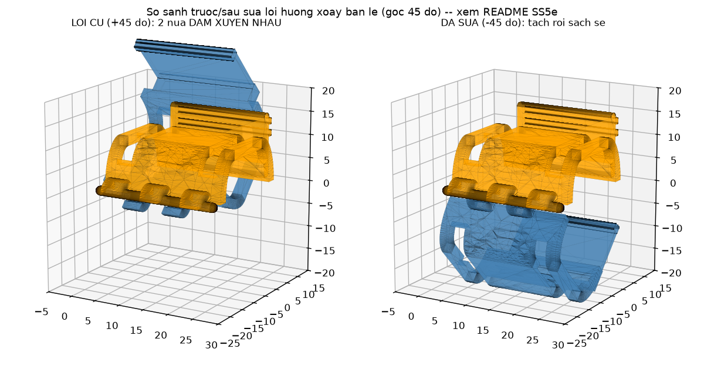
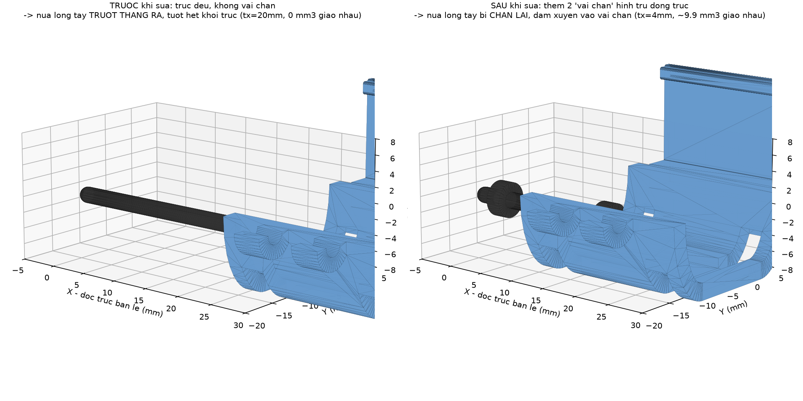
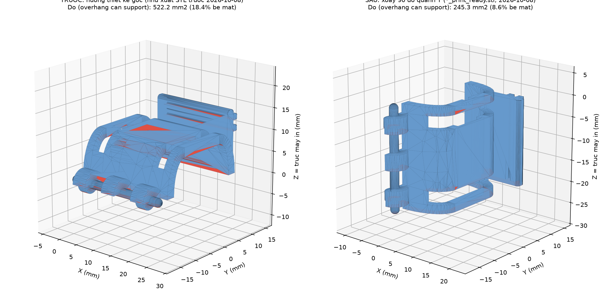

# Khung ốp 1 đốt ngón tay — cơ chế BẢN LỀ + NGÀM CÀI (thay cơ chế "xỏ ngón vào ống kín")

> **Trạng thái:** `PROPOSED` — bản vẽ CAD tham số, **chưa in, chưa đo lực/preload thật, chưa có người dùng thử**.
> **Claim/quyết định liên quan:** `CLM-HW-004` (`research/claims/CLAIM_LEDGER.csv`), `DEC-HW-006` (`research/context/DECISION_LOG.md`).
> **Phạm vi:** làm đúng **1 đốt ngón tay trước** (theo yêu cầu), chưa nhân ra 3–5 ngón.
> Theo `AGENTS.md`: đây là **thiết kế cơ khí trên giấy**, không phải kết quả đo, không phải tuyên bố "đã hết đau/đã thoải mái" — mọi tính từ công thái học (thoải mái, nhanh, không đau) đều là **mục tiêu thiết kế cần kiểm chứng sau khi in**, không phải kết luận.

---

## 1. Vấn đề đang muốn sửa

Thiết kế ốp ngón hiện có trong `docs/04_Hardware_Architecture.md` (§6, §8) là một **ống gần như kín**, có **bu-lông kẹp vi chỉnh preload** siết quanh ngón tay để ép hai vách cảm biến (Velostat) vào hai bên lòng/mu ngón. Nhược điểm với đúng nhóm người dùng của đề tài (sau đột quỵ, bàn tay liệt/co cứng, khó chủ động gập — xem `README.md` §1 mục tiêu đề tài):

- Phải **luồn/ép đốt ngón co cứng qua một vòng gần kín** → đau, khó, nhiều khi cần 2 người.
- Siết bu-lông quanh ngón đang co cứng → khó canh lực, dễ siết lệch, dễ gây khó chịu thêm.

**Yêu cầu của chủ dự án (nguyên văn rút gọn):** "trên đốt ngón có 1–2 bản lề, mở ra để đặt khung vào phía trên tay bệnh nhân, bên dưới chỉ cần cài lại — bệnh nhân không phải cố xỏ ngón tay vào một cách đau đớn."

→ Bài toán cơ khí: biến ống kín thành **vỏ-sò (clam-shell)** có 1 cạnh mở được (bản lề) và 1 cạnh khóa nhanh (ngàm cài), vẫn giữ được 2 vách cứng đối xứng (mu/lòng) để dán sensing element như kiến trúc đo vi sai đã chọn (`docs/04` §3.2, "mỗi khớp có cặp sensing element đối xứng trên hai vách đối diện").

## 2. Tham khảo thị trường (tham khảo nguyên lý — KHÔNG sao chép hình học)

| Sản phẩm/khái niệm | Nguyên lý lấy làm tham khảo | Khác với thiết kế ở đây |
|---|---|---|
| **Oval-8® Finger Splint** (nẹp ngón PIP/DIP bán thương mại) — [AliMed](https://www.alimed.com/products/oval-8-finger-splint) (`SRC-OVAL8-ALIMED`) | "Open design eliminates skin issues and discomfort" — vòng **hở sẵn một khe**, lắp bằng cách lách qua khe đàn hồi, không phải xỏ kín từ đầu ngón | Oval-8 là **một khối nhựa đàn hồi duy nhất** (tự bung ra rồi tự khép lại nhờ độ đàn hồi vật liệu), không có bản lề trục hay ngàm cài rời. Thiết kế ở đây dùng **bản lề trục in 3D + chốt** vì PETG/PLA không đàn hồi tốt như nhựa nhiệt dẻo y tế của Oval-8 → không thể chỉ dựa vào lò xo vật liệu để vừa giữ chặt vừa dễ mở. |
| **Nẹp ngón nhiệt dẻo 2 mảnh** — [Cults3D / RafaelNaranjo](https://cults3d.com/en/3d-model/various/finger-orthosis-thermoformable-3d-printed-rafaelnaranjo) (`SRC-FINGERORTHO-CULTS3D`) | 2 mảnh cứng nối bằng vùng mềm, cố định bằng **dây chun/Velcro xuyên khe** | Thiết kế ở đây giữ ý tưởng "khe xuyên dây đai" làm **lớp khóa an toàn phụ** (mục 6), nhưng khóa chính là ngàm cơ khí chứ không phải dây đai. |
| **HERO Grip Glove** (robot hỗ trợ bàn tay sau đột quỵ, PMC7045638) (`SRC-HEROGLOVE-PMC2020`) | Benchmark công thái học: **don < 5 phút, doff < 1 phút**, thiết kế riêng cho tay liệt/co cứng, không cần tự chủ động gập để đeo | Dùng làm **mốc so sánh mục tiêu** (không phải của thiết bị này) cho tiêu chí "thời gian mang/tháo" đã nêu ở `docs/04` §6. |
| Bản lề khớp ống in 3D kiểu "piano hinge" (kiến thức phổ biến trong cộng đồng in 3D, không gắn với 1 sản phẩm cụ thể) | Khớp ống so le (knuckle) + chốt rời — in được bằng FDM mà không cần vật liệu đàn hồi | Áp dụng trực tiếp cho cạnh bản lề của khung ốp. |

**Tra cứu bằng sáng chế:** chưa thực hiện cho riêng cơ cấu bản lề/ngàm này (khác phạm vi với tra cứu `US20150233779A1`/`CN116954366A` đã ghi ở `README.md` §8, vốn là về *mảng cảm biến*, không phải *cơ cấu kẹp cơ khí*). Cơ cấu bản lề-ngàm nói chung là kỹ thuật phổ biến trong hộp/vỏ nhựa và nẹp y tế; **FTO cho riêng chi tiết này chưa tra**, không tuyên bố mới.

## 3. Nguyên lý cơ cấu đề xuất

```
                    CẠNH BẢN LỀ (trái)             CẠNH NGÀM CÀI (phải)
                   ┌──────────────┐               ┌──────────────┐
  Nửa MU TAY (A)   │  3 khớp ống   │   vách cứng   │  khối ngàm    │
  — cố định,       │  (knuckle)    │  + hốc dán    │  2 nấc răng   │
  đặt lên trước    │  xen kẽ với B │  Velostat     │  (cố định)    │
                   └──────┬───────┘               └──────┬───────┘
                          │ chốt Ø2mm xuyên suốt          │
  Nửa LÒNG TAY (B) ┌──────┴───────┐               ┌──────┴───────┐
  — xoay quanh     │  2 khớp ống   │   vách cứng   │  tay đòn đàn  │
  bản lề để đóng   │  (knuckle)    │  + hốc dán    │  hồi, có móc  │
                   └──────────────┘               └──────────────┘

  Thao tác: (1) đặt đốt ngón vào lòng nửa A (đang để hở, B đang mở ra ~150°)
            (2) gập B xuống quanh trục chốt
            (3) ấn nhẹ tay đòn ở B cho móc "tách" vào 1 trong 2 nấc răng của A
            (4) (tuỳ chọn) luồn dây đai/Velcro qua khe phụ ở 2 đầu để khóa an toàn lớp 2
  Mở ra: lấy ngón tay ra bằng cách bẩy nhẹ tay đòn ra khỏi nấc răng — không cần tháo chốt.
```

Ảnh xem nhanh (dựng từ STL, xem thêm trong `out/renders/`):

| Trạng thái MỞ | Trạng thái ĐÓNG |
|---|---|
|  |  |
|  |  |

Từng mảnh riêng:

| Nửa mu tay (A, cố định, mang khối ngàm) | Nửa lòng tay (B, xoay quanh bản lề, mang tay đòn) |
|---|---|
|  |  |

Chốt bản lề (chi tiết rời, không in liền khối với vỏ — xem lý do ở mục 5):


**Vì sao không dùng "bản lề sống" (living hinge) in liền khối một mảnh?** Living hinge cần vật liệu dẻo dai khi gập mỏng (PP, hoặc TPU) và in rất mỏng (~0,6–1 mm) theo đúng hướng sợi; PETG/PLA — vật liệu đang dùng cho khung ốp (`docs/04` §6) — giòn hơn, living hinge bằng PETG/PLA dễ gãy sau vài chục lần gập/mở. Bản lề trục + chốt rời (kiểu "piano hinge") bền hơn khi in bằng PETG/PLA và cho phép thay chốt nếu mòn.

## 4. Thông số tham số hoá

Toàn bộ nằm trong class `P` ở đầu `finger_shell_hinge.py`. Các số dưới đây là **giá trị khởi tạo cho đốt gần (proximal phalanx) ngón trỏ/giữa người lớn, LẤY TẠM** — bắt buộc đo lại bằng thước cặp trước khi in bản dùng thật (nguyên tắc "ngân sách thiết kế, không phải kết quả đo" — `docs/04` đầu file).

| Tham số | Giá trị khởi tạo | Ý nghĩa |
|---|---|---|
| `L` | 24 mm | Chiều dài khung dọc ngón, đặt giữa thân đốt, tránh 2 khớp MCP/PIP |
| `W_in`, `H_in` | 19 mm, 16 mm | Kích thước trong (ngang × dày) quanh đốt ngón — **phải đo tay** |
| `t_wall` | 2.2 mm | Bề dày vách — PETG, ≥ 5 vòng tường (nozzle 0.4 mm) để cứng vững quanh hốc cảm biến |
| `flat_w` | 12 mm | **[2026-10-07, thay cho `r_in`/`r_out` cũ]** Bề rộng đoạn THẲNG ở giữa mặt mu/lòng tay (chỗ dán cảm biến) — 2 cạnh hông (bản lề + ngàm) bo tròn hết mức bằng cung elip lớn, xem §5d |
| `pocket_w/len/depth` | 8 / 16 / 1.3 mm | Hốc khoét để dán sandwich Velostat + đồng tự dính (theo `docs/04` §6) |
| `r_knuckle`, `r_pin` | 3.0 / 1.3 mm | Khớp ống bản lề (Ø ngoài 6 mm) và lỗ xỏ chốt/khớp xoay (Ø 2.6 mm) |
| `pin_clearance` | 0.3 mm | **[2026-10-07]** Khe hở BÁN KÍNH giữa trục đặc và lỗ — cho bản lề "in tại chỗ" (xem §5e), cần hiệu chỉnh theo máy in thật |
| `n_knuckle_top/bot` | 3 / 2 | Số khớp ống xen kẽ — **phải lệch nhau đúng 1** để xen kẽ đều (có `assert` trong code) |
| `catch_h`, `tooth_h`, `tooth_pitch` | 14 / 0.9 / 2.6 mm | Khối ngàm cố định, 2 nấc răng (preload thấp/cao) — `catch_h` tăng từ 9→14mm khi sửa lỗi lệch Z, xem §5c |
| `arm_h`, `arm_t`, `arm_hook` | 13 / 1.1 / 1.1 mm | Tay đòn đàn hồi + độ sâu móc |
| `strap_slot_w/h` | 3.2 / 6.0 mm | Khe luồn dây đai phụ (Velcro/thun) — khóa an toàn lớp 2 |

**Cách chỉnh preload (lực ép lên sensing element) ở bản v1 này:** thô, theo 2 nấc răng của ngàm (nấc 1 = ép nhẹ, nấc 2 = ép chặt hơn) — xem mục 8 "Giới hạn" về việc cần tinh chỉnh fine hơn (vít vi chỉnh) ở bản sau.

## 5. Môi trường dựng CAD (đã thử FreeCAD trước, không cài được trong sandbox này)

Theo đúng yêu cầu, đã thử cài FreeCAD trước. Trong môi trường chạy agent này **không có quyền truy cập kho `apt`/Debian** (chỉ cho phép ra ngoài tới GitHub/PyPI/npm), nên **không cài được gói `freecad` qua `apt`** và cũng không có GUI để chạy FreeCAD AppImage. Cũng đã thử tải thẳng **OpenSCAD AppImage** từ GitHub Releases — tải được trang `github.com` nhưng file nhị phân thật được GitHub chuyển hướng (redirect) sang `release-assets.githubusercontent.com`, domain này **không nằm trong danh sách host được phép ra ngoài** của sandbox.

**Giải pháp cuối cùng — 2 bản CAD song song, CẢ HAI đều đã chạy thật và ĐỐI CHIẾU chéo với nhau:**

1. **`finger_shell_hinge.py` (CadQuery → lõi hình học Open CASCADE, cùng lõi FreeCAD dùng bên trong):** cài qua `pip` (gói `cadquery-ocp` lấy OCCT dạng wheel từ PyPI, không cần `apt`). Gói này cần `libGL.so.1` lúc nạp module dù không render OpenGL thật, nên đã tạo một **thư viện giả (`stub`) `libGL.so.1`** bằng `gcc` (toàn hàm rỗng, chỉ để thoả mãn trình liên kết động). Dựng khối/boolean/fillet/xuất STEP/STL chạy trên lõi OCCT thật.
2. **`finger_shell_hinge.scad` (OpenSCAD → lõi hình học CGAL):** viết tay theo cú pháp OpenSCAD để bạn mở trực tiếp bằng app OpenSCAD miễn phí ([openscad.org](https://openscad.org/downloads.html)) trên máy mình, không cần Python. **Đã tìm được cách chạy CHÍNH ENGINE OPENSCAD ngay trong sandbox này** qua gói npm [`openscad-wasm-prebuilt`](https://www.npmjs.com/package/openscad-wasm-prebuilt) (bản WASM của OpenSCAD, chạy qua Node.js — `registry.npmjs.org` nằm trong danh sách host được phép) — xem `render_scad_wasm.mjs`. Đây là OpenSCAD **phiên bản 2025.01.19 thật**, không phải giả lập.

**Kết quả đối chiếu (`cross_check.py`, so thể tích + bounding-box của từng chi tiết xuất ra từ 2 lõi hình học độc lập — OCCT vs CGAL):**

| Chi tiết | Thể tích CadQuery/OCCT | Thể tích OpenSCAD/CGAL | Lệch | Bounding-box |
|---|---:|---:|---:|---|
| `top_shell_dorsal` | 2164.0 mm³ | 2161.8 mm³ | 0.10% | khớp tuyệt đối (25.0 × 32.06 × 15.0 mm) |
| `bottom_shell_palmar` | 1963.1 mm³ | 1961.1 mm³ | 0.10% | khớp tuyệt đối (24.0 × 33.10 × 23.2 mm) |
| `hinge_pin` | 76.4 mm³ | 76.2 mm³ | 0.27% | khớp tuyệt đối (25.0 × 2.0 × 2.0 mm) |

*(Số liệu trên là của bản mới nhất, 2026-10-07, sau khi sửa lỗi va chạm bản lề + đổi khe hở in-tại-chỗ — xem §5e. Số liệu sẽ còn thay đổi nhẹ mỗi khi chỉnh tham số hình học; chạy lại `cross_check.py` để lấy số mới nhất, đừng tin số cố định trong bảng này.)*

Sai số dưới 0,3% chỉ đến từ rời rạc hoá hình tròn (`$fn`), không phải sai lệch công thức. **Đây là bằng chứng độc lập (2 lõi CAD khác nhau — OCCT vs CGAL — cho cùng kết quả) rằng cả 2 file mô tả đúng cùng một hình học**, chứ **KHÔNG phải** bằng chứng thiết kế đã đúng về công thái học/cơ học — việc đó vẫn cần in thật + đo thật (mục 8).

**Dùng file `.scad` (khuyến nghị nếu bạn chỉ có máy cá nhân, không muốn cài Python):**

```bash
# 1. Cài OpenSCAD (Windows/macOS/Linux): https://openscad.org/downloads.html
# 2. Mở file:
openscad hardware/cad/finger_shell_hinge/finger_shell_hinge.scad
# 3. Trong OpenSCAD: Window > Customizer để chỉnh tham số bằng thanh trượt;
#    đổi biến PART ở cuối file ("top" | "bottom" | "pin" | "assembly_closed" | "assembly_open");
#    F5 = xem nhanh, F6 = render đầy đủ (bắt buộc trước khi xuất);
#    File > Export > Export as STL khi PART="top" hoặc "bottom" để lấy file in.
```

**Dùng file `.py` (CadQuery):**

```bash
python3 -m venv .venv && source .venv/bin/activate
pip install cadquery numpy-stl matplotlib
python3 hardware/cad/finger_shell_hinge/finger_shell_hinge.py   # xuất STEP/STL vào out/
python3 hardware/cad/finger_shell_hinge/render_preview.py       # xuất ảnh xem nhanh vào out/renders/
python3 hardware/cad/finger_shell_hinge/check_hinge_sweep.py    # [MỚI] quét va chạm bản lề qua cả dải góc mở — xem §5e
```

**Tự render `.scad` bằng engine OpenSCAD thật (qua Node.js, không cần cài OpenSCAD desktop) + tự đối chiếu:**

```bash
cd hardware/cad/finger_shell_hinge
npm install                 # cài openscad-wasm-prebuilt (~11MB, 1 gói)
node render_scad_wasm.mjs   # render ca 5 PART bang chinh OpenSCAD, xuat STL vao out/scad/
python3 cross_check.py      # so the tich + bounding-box voi out/*.stl (ban CadQuery)
```

(Nếu máy bạn thiếu `libGL.so.1` khi chạy bản CadQuery — ví dụ container tối giản — chỉ cần cài `libgl1` qua `apt` bình thường; sandbox này mới cần thủ thuật stub vì không có `apt`. Cách FreeCAD GUI thật nếu máy bạn có đủ mạng: `sudo apt-get install freecad && freecad hardware/cad/finger_shell_hinge/out/top_shell_dorsal.step`.)

## 5a. Lỗi đã sửa — tay đòn ngàm cài từng là 1 khối RỜI, không in được (2026-10-07)

**Người dùng phát hiện bằng mắt** khi tự mở `finger_shell_hinge.scad` bằng chính OpenSCAD trên máy mình: ở trạng thái "mở" (`assembly_open`), một mảnh phẳng nhỏ nổi lơ lửng tách rời hẳn khỏi phần vỏ chính — ảnh chụp cho thấy rõ khoảng trống giữa 2 khối.

**Kiểm chứng lại bằng số:** tay đòn ngàm cài (`latch_arm`, tay đòn đàn hồi gắn vào nửa lòng tay) được đặt ở toạ độ Y bắt đầu từ ~15.05mm (tâm) trong khi mép ngoài cùng của vỏ chỉ tới Y = W_out/2 ≈ 11.7mm — **lệch một khoảng trống ~2.8mm, không chạm vào vỏ ở bất kỳ lát cắt nào**. Dùng thư viện `trimesh` tách mảnh rời (`check_connectivity.py`) xác nhận: file STL `bottom_shell_palmar` (cả bản CadQuery lẫn bản OpenSCAD) bị tách thành **2 mảnh độc lập** — vỏ chính (~1660 mm³) và tay đòn+móc (~321 mm³) bay riêng, không hề dính vào nhau.

**Quan trọng:** đây là **lỗi thiết kế thật, tồn tại ở CẢ bản `.py` (CadQuery) VÀ bản `.scad` (OpenSCAD)** — không phải lỗi chuyển soạn từ file này sang file kia. Vì `cross_check.py` (mục 5) chỉ so khớp 2 bản **với nhau**, một lỗi giống hệt nhau ở cả 2 bản sẽ không bị phát hiện bằng cách đó — đây là lý do quan trọng để **luôn kiểm tra bằng mắt / bằng công cụ độc lập thứ 3**, không chỉ tin vào việc 2 bản khớp nhau.

**Đã sửa** (cả 2 file): thêm một **"gốc nối" (rib) đặc**, bắc cầu từ mép vỏ thật (lấn 0.3mm vào vỏ, giống cách khối răng `latch_catch` đã làm) tới mặt trong của tay đòn (lấn thêm 0.3mm vào tay đòn), nằm gọn trong vùng Z của nửa lòng tay (không đụng khối răng ở nửa mu tay). Đã chạy lại toàn bộ pipeline kiểm chứng sau khi sửa:

```
$ python3 check_connectivity.py
Nguon     File                          So manh roi   Ket qua
CadQuery  top_shell_dorsal.stl          1             OK (1 khoi lien)
CadQuery  bottom_shell_palmar.stl       1             OK (1 khoi lien)   <- truoc khi sua: 2
CadQuery  hinge_pin.stl                 1             OK (1 khoi lien)
OpenSCAD  top_shell_dorsal.stl          1             OK (1 khoi lien)
OpenSCAD  bottom_shell_palmar.stl       1             OK (1 khoi lien)   <- truoc khi sua: 2
OpenSCAD  hinge_pin.stl                 1             OK (1 khoi lien)
```

và `cross_check.py` vẫn PASS sau khi sửa (2 bản vẫn khớp nhau, lệch <0.3%). **`check_connectivity.py` đã được thêm làm bước kiểm tra bắt buộc** — chạy nó mỗi khi chỉnh sửa hình học, trước khi tin tưởng bất kỳ chi tiết nào in được nguyên khối.

Bài học: dù CAD đã "chạy được" (không lỗi CGAL/OCCT, bbox/thể tích đúng dự kiến), **không có nghĩa là hình học đó in được thành 1 khối** — vẫn cần kiểm tra tính liên kết (connectivity) riêng, vì phép hợp (`union`/`fuse`) của 2 khối không chạm nhau sẽ "thành công" về mặt code nhưng tạo ra 2 vật thể độc lập.

**Lỗi #2 (cùng ngày, cùng phiên phát hiện):** chủ dự án nhận ra ảnh lắp ráp (đóng/mở) **thiếu hẳn trục chốt bản lề** — 2 nửa vỏ có đủ khớp ống xen kẽ nhưng không có gì "xuyên qua" để giữ chúng lại, nhìn giống bản lề rỗng. Nguyên nhân: `export_assembly_state()` (.py) và `assembly_closed()`/`assembly_open()` (.scad) vốn chỉ vẽ 2 nửa vỏ, **quên vẽ `hinge_pin`/`build_pin()`** dù chi tiết chốt đã có sẵn trong file từ đầu (xuất riêng ra `hinge_pin.stl`). Đã sửa: thêm trục (màu xám đậm để phân biệt) vào cả 2 trạng thái lắp ráp ở cả 2 file; vì trục nằm đúng trên tâm trục xoay nên vị trí của nó không đổi giữa đóng/mở, không cần tính toán thêm.

## 5b. Thay đổi thiết kế theo yêu cầu — trục bản lề HÀN LIỀN vào nửa mu tay (2026-10-07)

**Yêu cầu của chủ dự án:** "cố định trục xám này với bản lề chính... khi in ra in nguyên 1 khối chứ không cần thay đổi" — tức muốn **bỏ việc chốt là 1 chi tiết rời phải lắp tay** (xỏ que/chốt qua lỗ sau khi in), thay vào đó **hàn trục liền vào nửa mu tay (bản lề cố định)** ngay từ lúc in.

**Đã làm** (tham số `PIN_INTEGRATED`, mặc định `true` ở cả 2 file):
- Nửa mu tay (`top_shell`) **không còn khoan lỗ chốt nữa** — thay vào đó, trục (đường kính giống hệt `hinge_pin.stl` trước đây) được **hợp nhất (`union`)** thẳng vào khối, nên `top_shell_dorsal.stl`/`.step` xuất ra **đã bao gồm sẵn trục**, in 1 lần duy nhất ra 1 khối liền (thể tích tăng từ ~2169mm³ lên ~2258mm³, đúng bằng thể tích trục ~78.5mm³ được cộng vào — đã kiểm chứng bằng `check_connectivity.py`: vẫn là 1 khối liền).
- Nửa lòng tay (`bottom_shell`) **vẫn luôn khoan lỗ** (khe hở bán kính 0.15mm) ở các khớp ống của nó — để có thể **trượt/xoay tự do quanh trục cố định** đã gắn liền vào nửa kia. Đây là phần BẮT BUỘC phải tách rời, vì nó cần di chuyển (mở ra/đóng vào) — không thể hàn liền với nửa mu tay.
- Lắp ráp: in 2 nửa riêng (mu tay đã có sẵn trục, lòng tay có lỗ trượt) → luồn khớp ống của nửa lòng tay vào dọc theo trục cố định từ một đầu (thao tác y hệt như trước, chỉ khác là không còn chi tiết chốt thứ 3 rời nữa).
- Vẫn giữ `PART = "pin"` và vẫn xuất `hinge_pin.stl` **chỉ để tham khảo kích thước trục** (không cần in riêng nữa ở chế độ mặc định).
- Muốn quay lại thiết kế cũ (chốt rời, có thể thay bằng que kim loại)? Đặt `PIN_INTEGRATED = False` (`.py`) hoặc `PIN_INTEGRATED = false;` (`.scad`, trong Customizer) rồi chạy lại.

**⚠️ Đánh đổi cần biết (không giấu):** mục 6 (hướng dẫn in) trước đây khuyến nghị **KHÔNG in chốt bằng nhựa** mà dùng que kim loại/nhựa cứng có sẵn (que hàn nhựa, đinh ghim, dây đồng Ø2mm) — lý do: một que nhựa mảnh (bán kính ~1mm) in bằng FDM dễ cong/gãy hơn vật liệu sẵn có, nhất là chịu lực uốn lặp lại của bản lề. **Khi hàn liền trục vào vỏ (`PIN_INTEGRATED=true`), ta mất luôn lựa chọn thay bằng que kim loại đó** — nếu trục in bị gãy trong lúc dùng, phải **in lại nguyên cả nửa mu tay**, không chỉ thay 1 que nhỏ như trước. Bù lại: ít chi tiết rời hơn (không lo mất chốt), lắp nhanh hơn (bớt 1 bước), và trục được 3 khớp ống "ôm" dọc suốt chiều dài nên có thể còn cứng vững hơn so với 1 que rời chỉ ăn khớp bằng ma sát. Đây là đánh đổi thiết kế, **chưa có số đo độ bền thật** — vẫn cần in thử + thử uốn/gập lặp lại trước khi kết luận cách nào bền hơn (xem mục 8).

## 5c. Lỗi đã sửa — móc và răng ngàm cài LỆCH NHAU 5-9mm, không bao giờ chạm được (2026-10-07)

**Bối cảnh:** chủ dự án yêu cầu "bo tròn đi bạn, rồi hoàn thiện, check lại cơ chế chính xác". Khi rà soát lại bằng tay toạ độ Z của từng nấc răng (`latch_catch`) so với toạ độ Z của móc (`latch_arm`, ở đầu tay đòn), phát hiện:

- Móc (hook) nằm ở Z = 11.20 – 12.80mm (công thức `arm_h - 1.0`, không đổi từ trước).
- Cả 2 nấc răng (cũ) nằm ở Z = 2.45 – 3.85mm và 5.05 – 6.45mm (công thức `catch_h * 0.35 + i*tooth_pitch`, tính **độc lập hoàn toàn** với công thức của móc).
- **Khoảng cách gần nhất giữa móc và răng gần nhất: ~4.75mm — không có bất kỳ điểm chồng lấn Z nào.** Theo trục Y thì 2 chi tiết có chồng lấn (Y = 13.55-14.86mm), nhưng vì Z hoàn toàn lệch nhau nên **móc không bao giờ chạm được răng khi gập xuống** — ngàm cài như cũ **không thể khóa được**, dù cả tay đòn lẫn khối ngàm đều "in được" bình thường (liền khối, đúng kích thước).

**Vì sao lỗi này không bị 2 công cụ kiểm tra trước đó bắt được:**
- `cross_check.py` chỉ so khớp bản `.py` và bản `.scad` **với nhau** — công thức lệch Z nói trên tồn tại **giống hệt ở cả 2 file** (cùng 1 nguyên nhân gốc: 2 công thức được viết độc lập, không tham chiếu chéo, trôi lệch nhau qua một lần sửa trước), nên so khớp 2 bản vẫn PASS.
- `check_connectivity.py` chỉ đếm số mảnh rời — răng và móc đều là một phần **liền khối** với vỏ chính của chúng (không rời ra thành mảnh riêng), nên cũng PASS.

Hai công cụ trên kiểm tra "chi tiết có in được không" (liền khối, đúng thể tích/kích thước) chứ **không kiểm tra "2 chi tiết có vai trò ăn khớp với nhau thì có thực sự giao nhau về hình học không"** — đây là một lớp lỗi khác, chỉ lộ ra khi **tính tay toạ độ cụ thể** của từng chi tiết rồi so sánh, đúng như yêu cầu "check lại cơ chế chính xác".

**Đã sửa** (cả 2 file): thay vì tính vị trí răng theo 1 tỉ lệ độc lập, giờ **tính trực tiếp từ vị trí nghỉ của móc** (`hook_rest_z = arm_h - 1.0`, cùng công thức dùng trong `latch_arm`), để 2 chi tiết **luôn thẳng hàng** dù sau này có đổi `arm_h`/`tooth_pitch`:
- Nấc 0: `z = hook_rest_z` (≈12.0mm) — nấc móc tự ăn khớp khi gập hẳn xuống.
- Nấc 1: `z = hook_rest_z - tooth_pitch` (≈9.4mm) — móc trượt qua nấc này trước khi tới vị trí nghỉ (cảm giác "tách" 2 nấc khi gập). **Lưu ý:** cách diễn giải "2 nấc = 2 mức khóa" là một giả thuyết cơ khí hợp lý nhưng **CHƯA được kiểm chứng bằng mẫu in thật** — chỉ xác nhận được bằng CAD rằng móc và nấc 0 giao nhau hình học ở trạng thái nghỉ.
- Tăng `catch_h` từ 9.0mm lên 14.0mm (đủ chứa nấc 0 ở Z≈12 cộng biên an toàn), và thêm `assert(catch_h >= hook_rest_z + 1.5, ...)` ở cả 2 file để lần sau nếu ai đổi `arm_h`/`catch_h` mà quên cập nhật, CAD sẽ **báo lỗi ngay khi dựng hình** thay vì âm thầm sinh ra 1 ngàm không khóa được như lần này.

**Kiểm chứng bằng số liệu, lấy TRỰC TIẾP từ mã nguồn** (không phải tính tay/giả định — xem `check_latch_engagement.py`, công cụ kiểm tra mới thêm):

```
$ python3 check_latch_engagement.py
Moc (hook):  X=2.00..22.00  Y=13.55..15.75  Z=11.20..12.80
Nac rang 0: ... Y=13.06..14.86  Z=11.30..12.70  | chong lan Y=1.31mm Z=1.40mm -> AN KHOP
Nac rang 1: ... Y=13.06..14.86  Z=8.70..10.10   | chong lan Y=1.31mm Z=0.00mm -> khong giao nhau
KET LUAN: OK -- moc va it nhat 1 nac rang CO giao nhau hinh hoc ...
```

`cross_check.py` và `check_connectivity.py` vẫn PASS sau khi sửa (không có hồi quy — xem lệnh chạy ở §5a/§5b, kết quả tương tự).

**`check_latch_engagement.py` đã được thêm làm bước kiểm tra bắt buộc thứ 3** (bên cạnh `cross_check.py` và `check_connectivity.py`) — dùng cho bất kỳ 2 chi tiết nào có vai trò ăn khớp cơ học với nhau (không chỉ ngàm cài), để bắt đúng lớp lỗi "liền khối + đúng kích thước nhưng không tương tác được với nhau" mà 2 công cụ kia không bắt được.

**Giới hạn tự khai:** script chỉ kiểm tra bounding-box có giao nhau ở **trạng thái nghỉ tĩnh** (điều kiện CẦN để khóa được) — **không** mô phỏng lực cài, độ đàn hồi thực tế của tay đòn PETG mỏng (`arm_t=1.1mm`), hay đường đi 3D thực sự của móc khi xoay quanh bản lề (kiểm tra này giả định móc tiếp cận "thẳng xuống", trong khi thực tế là một cung xoay quanh trục bản lề ở xa). Đây **vẫn là thiết kế trên giấy, chưa in thử** — lực cài/mở, độ bền mỏi của tay đòn, và cảm giác "clic" 2 nấc vẫn cần xác nhận bằng mẫu in thật (xem mục 8).

### Bo tròn các cạnh (cùng yêu cầu "bo tròn đi bạn, rồi hoàn thiện")

Ngoài việc sửa lỗi lệch Z ở trên, đã bo tròn thêm các chi tiết sau (cả 2 file), chủ yếu để giảm cạnh sắc (an toàn khi tiếp xúc với tay người chăm sóc/bệnh nhân khi thao tác, giảm tập trung ứng suất khi in FDM) và cho cảm giác "hoàn thiện" hơn một bản thiết kế thô ráp:

- **2 đầu trục bản lề (hinge_pin):** trước đây là hình trụ cắt vuông (2 mặt phẳng tròn, cạnh sắc); giờ là "viên nang" (capsule) — 2 đầu bo tròn thành chỏm bán cầu. Giúp đầu trục dễ dùng làm mồi luồn qua các khớp ống khi lắp ráp, và an toàn hơn ở 2 đầu lộ ra ngoài.
- **Khối ngàm chính (`latch_catch`) và 2 nấc răng:** bo nhẹ các cạnh dọc theo chiều dài ngón tay (bán kính 0.3-0.8mm tuỳ bề dày từng chi tiết, luôn chọn nhỏ hơn 1 nửa bề dày mỏng nhất để không làm biến dạng/triệt tiêu chi tiết).
- **Thân tay đòn (`latch_arm`) và móc:** bo nhẹ tương tự (bán kính 0.3mm, nhỏ vì `arm_t`/`arm_hook` khá mỏng ~1.1mm) — **riêng "gốc nối" (root/rib) ở chân tay đòn CỐ Ý giữ cạnh vuông sắc**, không bo tròn, để không ảnh hưởng tới vùng tiếp xúc quan trọng với vỏ đã sửa lỗi liền khối ở §5a (đã xác nhận lại bằng `check_connectivity.py` sau khi bo — vẫn 1 khối liền, không hồi quy).
- **Chưa bo tròn:** mép hở 2 đầu ống (nơi tiết diện ống tròn-bo-góc gặp 2 mặt phẳng đầu ống thẳng, tại X=0 và X=L) — đây là nơi tiếp xúc trực tiếp với da nhiều nhất nên về lý thuyết cũng nên bo, nhưng việc bo tròn đầy đủ 3D ở đây đòi hỏi kỹ thuật dựng hình phức tạp hơn nhiều (có nguy cơ làm mỏng thành ống ở đúng đầu mút nếu làm không cẩn thận) — **cố tình hoãn lại**, ưu tiên sự chắc chắn/an toàn của hình học hơn là làm nhanh cho đẹp. Nếu chủ dự án muốn, đây sẽ là việc cần làm ở vòng sau.

**Lưu ý kỹ thuật khi dựng bằng OpenSCAD:** ban đầu dùng `hull()` của 2 hình cầu để tạo "viên nang" cho trục — dựng ĐƯỢC từng chi tiết riêng lẻ, nhưng khi `union()` vào toàn bộ lắp ráp phức tạp (`top_shell`) thì CGAL (bộ dựng hình của OpenSCAD) báo lỗi nội bộ ("assertion violation") và ÂM THẦM cắt mất ~0.5mm ở mỗi đầu trục (không crash, không báo lỗi ra STL, chỉ lộ ra khi so bounding-box với bản CadQuery bằng `cross_check.py`). Đã đổi sang dựng "viên nang" bằng `union()` của 1 hình trụ ngắn hơn + 2 chỏm cầu (hình dạng giống hệt, nhưng ổn định hơn với CGAL) — sau khi đổi, `cross_check.py` khớp lại hoàn toàn (<0.1% lệch thể tích, bbox khớp đến 0.003mm). Đây là một ví dụ cụ thể cho thấy **"không có lỗi CGAL/không crash" không đồng nghĩa với "hình học đúng như ý đồ"** — bài học tương tự mục 5a, lần này ở công cụ OpenSCAD thay vì CadQuery.

## 5d. Thay đổi thiết kế theo yêu cầu — tiết diện "hình trụ" thay cho hộp chữ nhật bo góc (2026-10-07)

**Phản hồi của chủ dự án** sau khi xem ảnh trạng thái đóng: tiết diện hộp chữ nhật bo góc nhìn "vuông, cứng ngắc", đề nghị đổi sang dáng tròn/hình trụ hơn.

**Làm rõ trước khi sửa:** ngón tay thật có tiết diện hơi bầu dục (rộng hơn dày — `W_in=19mm` x `H_in=16mm`), và 2 cạnh hông của khung cần có **mặt tương đối phẳng** để gắn 3 khớp bản lề + khối ngàm cài, còn 2 mặt mu/lòng tay cần **mặt phẳng** để dán hốc cảm biến Velostat+đồng (`pocket_w=8mm`). Một hình trụ tròn thật (1 đường kính duy nhất, không còn phân biệt rộng/dày) sẽ cần thêm "mấu" phẳng nhô ra mới gắn được bản lề/ngàm — thay đổi lớn hơn, nên đã hỏi lại chủ dự án và chọn phương án: **bo tròn hết mức có thể ở 2 cạnh hông, giữ nguyên 2 mặt mu/lòng tay phẳng**.

**Đã làm** (cả 2 file, hàm `rounded_prism()`/`capsule_prism()` dựng lại từ đầu):
- Bỏ hẳn cách bo góc chữ nhật kiểu cũ (`r_in=2.5mm`, `r_out=4.0mm` — góc bo nhỏ so với kích thước tổng, nhìn "vuông, cứng ngắc" như chủ dự án nhận xét).
- Tiết diện mới là 1 lăng trụ **"viên thuốc dẹt" (capsule)**: 2 mặt mu tay/lòng tay chỉ còn 1 đoạn **THẲNG** ở giữa rộng `flat_w=12mm` (đủ chứa hốc cảm biến 8mm + biên 2mm mỗi bên) — đủ để dán phẳng cảm biến/luồn dây đai. Toàn bộ phần còn lại của tiết diện, **kể cả 2 cạnh hông**, là 1 đường cong elip LIÊN TỤC nối tiếp tuyến (không góc gãy) với 2 đầu đoạn thẳng: với `W_out=23.4mm`, `H_out=20.4mm`, bán trục elip theo chiều rộng `a = W_out/2 - flat_w/2 = 5.7mm`, theo chiều dày `b = H_out/2 = 10.2mm`. Nói cách khác, cạnh hông không còn là góc bo nhỏ rời rạc như trước mà là 1 nửa elip trơn chạy suốt từ mép trên xuống mép dưới — không còn đoạn thẳng dọc hay góc vuông nào ở đó.
- Giới hạn hình học còn lại: đoạn thẳng `flat_w=12mm` ở mặt mu/lòng tay là bắt buộc phải giữ (chứa hốc cảm biến 8mm + biên 2mm mỗi bên); nếu giảm `flat_w` về gần 0 để tiến tới hình trụ/elip tròn tuyệt đối trên toàn tiết diện thì sẽ không còn đủ mặt phẳng để khoét hốc cảm biến — đây là lý do dừng ở `flat_w=12mm` thay vì bỏ hẳn mặt phẳng.
- **Đã kiểm tra độ dày thành còn lại** (giữa mặt ngoài và mặt trong, dọc theo cung elip, tính bằng toạ độ tham số — không phải đo trên mẫu in thật): mỏng nhất ≈ 2.08mm (tại góc ~52° so với mặt phẳng ngang), so với `t_wall=2.2mm` danh định — giảm ~6%, vẫn an toàn cho PETG 5 vòng tường 0.4mm. Vùng mặt phẳng (nơi hốc cảm biến) và vùng xích đạo cạnh hông (nơi gắn khớp bản lề) đều giữ đúng `t_wall=2.2mm`.
- **Bản lề và ngàm cài không cần sửa gì** — công thức gắn khớp ống (`add_hinge_knuckles`, tại `z=0`, `y=±W_out/2`) và gốc nối ngàm (`add_latch_catch`/`add_latch_arm`, cũng neo tại `y=±W_out/2`) đều dùng đúng điểm "xích đạo" của tiết diện mới, vị trí không đổi so với tiết diện cũ (elip tại z=0 vẫn chạm đúng y=±W_out/2, giống hệt hình chữ nhật bo góc cũ tại z=0) — đã xác nhận lại bằng `check_latch_engagement.py` và `check_connectivity.py`, không có hồi quy.

**Kiểm chứng:** `cross_check.py` khớp lại hoàn toàn giữa bản `.py` (CadQuery, dùng `ellipseArc()`) và bản `.scad` (OpenSCAD, dùng `polygon()` lấy mẫu 16 điểm/góc phần tư qua hàm số) — lệch thể tích 0.11-0.27% (chỉ do rời rạc hoá góc, OpenSCAD dùng đa giác xấp xỉ còn CadQuery dùng cung elip thật mượt của OpenCASCADE). `check_connectivity.py` và `check_latch_engagement.py` đều PASS, không hồi quy so với §5c.

**Giới hạn tự khai:** độ dày thành mỏng nhất (2.08mm) chỉ tính bằng công thức hình học (khoảng cách Euclid giữa 2 đường cong tham số hoá cùng góc — xấp xỉ, không phải khoảng cách pháp tuyến chính xác tuyệt đối), **chưa đo trên mẫu in thật** và chưa có phân tích độ bền cơ học (FEA) cho vùng thành cong mỏng hơn này so với bản chữ nhật cũ. Cảm giác "tròn trịa, bớt cứng ngắc" mới chỉ được xác nhận qua ảnh CAD (`out/renders/`), chưa xác nhận bằng cách cầm/sờ mẫu in thật.

## 5e. LỖI NGHIÊM TRỌNG đã sửa — 2 nửa vỏ ĐÂM XUYÊN NHAU khi mở + đổi sang bản lề "in tại chỗ" (2026-10-07)

**Yêu cầu chủ dự án** (nguyên văn ý): bản lề chỉ cần 1 nửa chứa sẵn trục, nửa kia được in BỌC QUANH trục đó ngay trong lúc in (không lắp tay), rồi khi lấy ra khỏi máy in là xoay được tự do quanh trục tại chỗ.

### Phần 1 — lỗi nghiêm trọng phát hiện khi kiểm tra lại yêu cầu này

Để trả lời đúng câu "xoay có tự do không", **lần đầu tiên bản vẽ này được quét kiểm tra va chạm hình học qua TOÀN BỘ dải góc mở** (trước đây chỉ xem bằng mắt ở ĐÚNG 1 góc cuối, 150°, qua ảnh `05_assembly_open_iso.png`). Dùng `top.intersect(bottom_xoay_tung_goc)` của CadQuery (phép giao boolean thật trên lõi OCCT, không phải ước lượng), phát hiện: **với dấu góc xoay cũ (+150°), 2 nửa vỏ THẬT SỰ ĐÂM XUYÊN NHAU** — thể tích giao nhau lên tới **~600mm³** (so với tổng thể tích 1 nửa ~2000mm³, tức là xuyên **30%** khối lượng) trong suốt khoảng góc **+5° đến +100°**. Ảnh chụp 2 khối ở +45° cho thấy rõ khối xanh (lòng tay) cắm thẳng vào khối cam (mu tay):

- Hướng SAI (+45°): nửa lòng tay xuyên qua nửa mu tay — xem bằng chứng quét (bảng dưới).
- Hướng ĐÚNG (-45°): 2 nửa tách rời sạch sẽ.

Nguyên nhân: trục bản lề được đặt lệch ra ngoài mép vỏ (để chừa chỗ cho khớp ống) nhưng **dấu chiều xoay (sign) bị chọn SAI** — xoay theo chiều đó khiến điểm xa trục nhất của nửa lòng tay (mép đối diện, phía ngàm cài) quét một cung đi THẲNG vào khối đặc của nửa mu tay trước khi ra khỏi vùng va chạm (chỉ "tình cờ" sạch trở lại ở đúng góc 150°, là góc duy nhất có ảnh render trước đây). Đây là lý do việc chỉ xem 1 ảnh tĩnh ở góc cuối **không đủ** để xác nhận "bản lề xoay được" — phải quét liên tục.


*Trái: dấu góc xoay CŨ (+45°) — khối xanh (lòng tay) cắm xuyên qua khối cam (mu tay). Phải: dấu ĐÃ SỬA (-45°) — 2 nửa tách rời sạch sẽ.*

**Đã sửa:** đổi dấu góc xoay trong `build_open_bottom_shell()` (`.py`) và `assembly_open()` (`.scad`) từ dương sang âm. **Đã thêm công cụ kiểm tra thường trực mới — `check_hinge_sweep.py`** — quét giao nhau mỗi 5° từ 0° đến 150°, FAIL nếu bất kỳ góc nào (ngoài vùng ngàm cài đang nhả ra ở 0-10°, nơi có chồng lấn nhỏ CỐ Ý do móc còn trượt qua răng) có giao nhau > 0.05mm³. Sau khi sửa: **0.0mm³ giao nhau ở MỌI góc từ 15° đến 145°, và chỉ 0.02mm³ (không đáng kể) ở 150°** — bằng chứng hình học rằng bản lề xoay tự do suốt hành trình, không chỉ ở điểm cuối.

**Đồng thời sửa luôn 1 lỗi nhỏ liên quan** phát hiện cùng lúc: khớp ống (knuckle) trước đây là hình trụ tròn ĐỦ, tâm đúng tại mặt phân 2 nửa (Z=0), nên một nửa khối của nó luôn "tràn" sang phía nửa kia — gây chồng lấn ~9.4mm³ không đổi theo góc xoay (vì nằm sát trục, không di chuyển khi quay). Đã cắt khớp ống về đúng nửa không gian của chính nó (`half_space()`/`intersection()`) trước khi union vào vỏ — chồng lấn này nay bằng 0.

**Giới hạn tự khai:** đây là bằng chứng HÌNH HỌC (2 khối CỨNG không đâm xuyên nhau), KHÔNG phải bằng chứng cơ học thật — ma sát, độ đàn hồi PETG, dung sai in thật (khớp ống không tròn hoàn hảo, co ngót vật liệu) có thể khiến bản lề thật bị kẹt dù mô hình CAD không báo lỗi. Việc phát hiện lỗi lớn này ở vòng kiểm tra trước (vốn đã công bố renders "đã xác nhận trực quan") cũng là lời nhắc: **kiểm tra bằng ảnh tĩnh 1 góc là KHÔNG ĐỦ** cho các cơ cấu chuyển động — từ nay `check_hinge_sweep.py` chạy mỗi khi đổi tham số hình học liên quan đến bản lề.

### Phần 2 — bản lề "in tại chỗ" (print-in-place) theo đúng yêu cầu

Thiết kế từ trước (§5b) đã có phần: `top_shell` hàn liền (union) trục bản lề đặc vào thân — khi `PIN_INTEGRATED=True` (mặc định). Phần còn thiếu để thành bản lề in-tại-chỗ đúng nghĩa là: (a) khe hở trục-lỗ đủ rộng để máy in FDM không làm dính liền 2 khối, và (b) một file in gộp cả 2 nửa làm 1 lần in.

- **Khe hở (`pin_clearance`):** trước đây là số viết tay 0.15mm bán kính (0.3mm đường kính) ngay trong code — theo các nguồn hướng dẫn thiết kế bản lề in-tại-chỗ FDM ([Snapmaker](https://www.snapmaker.com/blog/3d-printed-hinges/), [FastPreci](https://www.fastpreci.com/blog/3d-printed-hinges/), [QIDI 3D](https://qidi3d.com/blogs/news/how-to-3d-print-interlocking-parts-and-assemblies)), khoảng khuyến nghị phổ biến cho khớp quay in-tại-chỗ là **0.2-0.4mm bán kính** (0.15mm dễ bị dính liền nếu máy chưa hiệu chỉnh hoàn hảo, nhất là do "chân voi" lớp đầu). Đã tăng lên **0.3mm** (tham số `pin_clearance`, đặt tên rõ ràng thay vì số viết tay) và tăng `r_pin` (lỗ) từ 1.15mm lên 1.3mm để GIỮ NGUYÊN bán kính trục đặc ~1.0mm (không đổi độ cứng trục) mà vẫn đạt khe hở mới.
- **File in gộp:** hàm mới `export_print_in_place()` (`.py`) xuất **1 file STL duy nhất** (`out/assembly_open_print_in_place.stl`) chứa cả `top_shell` (đã có trục) và `bottom_shell` ở **trạng thái MỞ** (2 solid riêng biệt, không boolean-union, chỉ cách nhau đúng khe hở) — nạp thẳng file này vào slicer là in được cả 2 nửa cùng lúc, lấy ra là xoay ngay, không cần lắp. Bản `.scad` tương đương là `out/scad/assembly_open.stl` (đã xuất sẵn qua `render_scad_wasm.mjs`).
- **QUAN TRỌNG — vì sao là trạng thái MỞ chứ không phải ĐÓNG:** ở trạng thái ĐÓNG, ngàm cài (móc + răng) CỐ Ý chạm/ngoàm vào nhau (giao nhau ~51.5mm³ — đây là độ ngoàm cần thiết để khoá chặt, xem §5c) — nếu xuất file in gộp ở tư thế này, slicer sẽ in LIỀN 2 chi tiết ngàm cài thành 1 khối đặc dính nhau tại đúng chỗ ngoàm (không giống bản lề, chỗ này KHÔNG có khe hở), làm tay đòn đàn hồi mất khả năng bật ra — hỏng ngàm cài vĩnh viễn. Ở trạng thái MỞ (150°), ngàm cài tách xa nhau hẳn, nên an toàn để in gộp; **sau khi in xong, gập tay bằng tay để đóng + cài ngàm** như quy trình sử dụng vốn có.
- **Đã kiểm tra:** `assembly_open_print_in_place.stl` (`.py`) được load lại bằng `trimesh`, tách được đúng **2 thành phần kín nước (watertight) riêng biệt**, thể tích khớp với `top_shell`/`bottom_shell` xuất riêng (chênh < 0.1%) — xác nhận file là 2 khối thật sự tách rời (không bị dính), sẵn sàng để thử in. File `.scad` tương ứng (`out/scad/assembly_open.stl`) qua kiểm tra tương tự ra 1 mảnh kín nước duy nhất (OpenSCAD CSG `union()` hợp nhất 2 khối chạm/gần chạm thành 1 mesh — khác cách biểu diễn với bản `.py` nhưng cùng ý nghĩa: không có chỗ nào chồng lấn thể tích đáng kể ngoài dự kiến).

**Giới hạn tự khai (QUAN TRỌNG — chưa in thật):** khe hở 0.3mm là **điểm khởi đầu phổ biến theo tài liệu hướng dẫn chung**, KHÔNG phải số đã hiệu chỉnh cho máy in/vật liệu cụ thể nào — từng máy in (độ chính xác cơ khí, hiệu chỉnh dòng nhựa/flow, "chân voi" lớp đầu) có thể cần tăng/giảm. Khuyến nghị in thử 1 bản lề nhỏ (chỉ đoạn có khớp ống, vài cm) với 3-4 mức khe hở (0.2/0.25/0.3/0.35mm) trước khi in bản đầy đủ, theo đúng tinh thần "ngân sách thiết kế, không phải kết quả đo" của `docs/04`. Việc bản lề "xoay được trên CAD" (hình học) KHÔNG đảm bảo "xoay được khi in" (vật lý) — vẫn cần thử nghiệm in thật.

## 5f. LỖI đã sửa — trục bản lề KHÔNG CÓ gì chặn, nửa lòng tay có thể TUỘT dọc trục ra ngoài (2026-10-08)

**Yêu cầu chủ dự án:** kiểm chứng lại bản lề đủ 3 điều: (1) xoay tự do quanh trục, (2) không có lỗi, (3) **không dễ rơi/tuột ra ngoài**. (1) và (2) đã có bằng chứng từ §5e (`check_hinge_sweep.py`), nhưng (3) là một yêu cầu MỚI — khi kiểm tra lại, phát hiện đây KHÔNG CHỈ là một quan ngại giả thuyết mà là **một lỗi hình học thật sự chưa từng được kiểm tra**.

**Lỗi phát hiện:** `check_hinge_sweep.py` (§5e) chỉ quét **góc xoay**, chưa bao giờ quét **chuyển vị dọc trục** (translate dọc theo trục X của bản lề). Khi xem lại `build_pin()`, trục bản lề là một hình trụ **bán kính không đổi suốt chiều dài** (chỉ bo tròn 2 đầu thành chỏm bán cầu) — **không có vai/mũ/gờ nào rộng hơn lỗ khớp ống** ở bất kỳ đâu dọc trục. Vì 2 khớp ống của nửa lòng tay là 1 khối cứng duy nhất (di chuyển cùng nhau), **không có gì về mặt hình học ngăn cả nửa lòng tay trượt dọc theo trục và tuột hẳn ra khỏi 1 trong 2 đầu trục** — một rủi ro thật khi thao tác, tháo/lắp lên tay bệnh nhân, hoặc rung lắc khi dùng.

**Đã sửa:** thêm **2 "vai chặn" hình TRỤ ĐỒNG TRỤC** (collar, bán kính `pin_retain_r = 2.2mm`, dài `pin_retain_len = 2.0mm`) hàn liền vào trục, đặt đúng **tâm của khớp ống ĐẦU và CUỐI** thuộc nửa mu tay (đã có sẵn vật liệu boss `r_knuckle = 3.0mm` bao quanh ở đó) — vai chặn **ẩn gọn trong khối vật liệu có sẵn, không tạo gờ nhô mới ra ngoài vỏ** (2.2mm < 3.0mm). Vì bán kính vai chặn (2.2mm) lớn hơn hẳn bán kính lỗ khớp ống của nửa lòng tay (`r_pin = 1.3mm`), và mọi khớp ống của nửa lòng tay đều nằm **giữa** 2 vai chặn này theo trục X, nửa lòng tay **không thể trượt dọc trục qua khỏi vai chặn mà không đâm xuyên vật liệu thật** — chặn được cả 2 hướng tuột.

*Vì sao dùng hình TRỤ chứ không phải hình CẦU (phương án thử đầu tiên):* hình cầu tạo ra 1 điểm cực (pole) kỳ dị về mặt tham số hoá bề mặt — khi xuất STL, lưới tam giác hoá tại điểm cực này sinh ra 1 tam giác thể tích gần-bằng-0 bị `check_connectivity.py` báo nhầm là "mảnh rời" (artefact dựng lưới, không phải lỗi hình học thật — đã xác nhận bằng `.clean()` không giải quyết được). Đổi sang hình trụ **đồng trục với chính trục bản lề** thì không còn điểm kỳ dị nào — hết lỗi mảnh rời ngay, xác nhận lại bằng `check_connectivity.py` (PASS, 1 khối liền cho cả `.py` và `.scad`).

**Công cụ kiểm tra mới — `check_axial_retention.py`:** quét chuyển vị dọc trục X từ 0 đến ±25mm, tính thể tích giao nhau (boolean intersection) thật giữa `bottom_shell` đã dịch chuyển và trục (`build_pin()`), ở CẢ 2 phiên bản trục (cũ: không vai chặn / mới: có vai chặn) để làm đối chứng trước/sau:

| Hướng trượt | Trục CŨ (không vai chặn) | Trục MỚI (có vai chặn) |
|---|---|---|
| +X | 0.0 mm³ ở MỌI bước quét — **không chặn gì cả** | tới **9.90 mm³** giao nhau trước khi qua được — **bị chặn thật** |
| −X | 0.0 mm³ ở MỌI bước quét — **không chặn gì cả** | tới **9.90 mm³** giao nhau trước khi qua được — **bị chặn thật** |


*Trái: trục CŨ — nửa lòng tay trượt thẳng ra ngoài (dịch 20mm, 0mm³ giao nhau, không có gì cản). Phải: trục MỚI — 2 vai chặn hình trụ (khối đen) chặn đường trượt, nửa lòng tay đâm xuyên vào vai chặn (dịch 4mm, ~9.9mm³ giao nhau) trước khi có thể đi xa hơn.*

**Đã kiểm tra lại toàn bộ sau khi sửa (không hồi quy):** `check_hinge_sweep.py` vẫn PASS (0.0246mm³ tối đa trong vùng mở thật, không đổi so với §5e — vai chặn nằm ẩn trong boss sẵn có nên không ảnh hưởng va chạm khi xoay), `check_connectivity.py` PASS (1 khối liền cho cả `.py`/`.scad`), `check_latch_engagement.py` PASS (không đổi so với §5c), `cross_check.py` PASS (`.py` và `.scad` khớp hình học, lệch thể tích <0.3%).

**Giới hạn tự khai (QUAN TRỌNG):** đây là bằng chứng HÌNH HỌC rằng cần đâm xuyên vật liệu mới trượt qua được vai chặn — **KHÔNG phải** bằng chứng về LỰC cần thiết để thực sự kéo tuột (độ bền kéo/cắt của PETG tại vùng vai chặn, độ đàn hồi khi lắp ráp lần đầu lên trục, dung sai in thật). Bán kính/chiều dài vai chặn (2.2mm / 2.0mm) là **lựa chọn thiết kế trên CAD**, chưa kiểm chứng bằng mẫu in thật hay thử lực kéo — vẫn cần in thử và thử kéo tay trước khi coi là "chắc chắn không rơi ra" trong thực tế. Lỗi này cũng là ví dụ cụ thể cho bài học ở §5e: **một bộ kiểm tra chỉ quét 1 loại chuyển động (góc xoay) sẽ bỏ sót lỗi ở loại chuyển động khác (trượt dọc trục)** — từ nay cả `check_hinge_sweep.py` (xoay) VÀ `check_axial_retention.py` (trượt dọc trục) đều chạy mỗi khi đổi tham số hình học liên quan đến bản lề.

## 6a. Xoay hướng đặt lên bàn in để GIẢM SUPPORT tối đa (2026-10-08)

**Yêu cầu chủ dự án:** "xoay chỉnh sửa sao cho khi để lên slicer thì support tạo ra sẽ ít nhất đi".

Sandbox này **không có trình cắt lớp (slicer) thật** nào chạy được (không có PrusaSlicer/Cura CLI, không có mạng ra ngoài danh sách host cho phép) — nên không thể "mở file trong slicer rồi đếm số support" theo đúng nghĩa đen. Thay vào đó, đã viết `check_print_orientation.py` dùng đúng **tiêu chí hình học mà mọi slicer FDM dùng để quyết định sinh support**: một tam giác bề mặt cần support nếu nó **chúc xuống** và góc giữa pháp tuyến với phương ngang nhỏ hơn 45° (ngưỡng mặc định phổ biến của PrusaSlicer/Cura) — tính TRÊN CHÍNH lưới tam giác hoá thật của khối CAD (CadQuery `tessellate()`), không phải ước lượng bằng mắt.

**Cách làm:** quét **24 hướng đặt theo trục chính** (mọi cách "đặt phẳng 1 mặt xuống bàn rồi xoay quanh trục đứng" — đúng kiểu hay dùng khi tự xoay tay trong slicer), đo tổng diện tích overhang ở mỗi hướng, cho cả `top_shell_dorsal` và `bottom_shell_palmar`:

| Chi tiết | Hướng THIẾT KẾ GỐC (như xuất STL trước đây, không xoay) | Hướng TỐT NHẤT trong 24 hướng (đã chọn) |
|---|---|---|
| `top_shell_dorsal` | 522.2 mm² overhang (18.4% bề mặt) | **245.3 mm² (8.6% bề mặt)** — giảm 53% |
| `bottom_shell_palmar` | 249.1 mm² overhang (9.0% bề mặt) | **140.5 mm² (5.1% bề mặt)** — giảm 44% |


*Tam giác màu ĐỎ = bề mặt cần support (chúc xuống >45° so với phương ngang). Trái: hướng thiết kế gốc. Phải: hướng đã xoay (90° quanh trục Y, trục bản lề thẳng đứng) — vùng đỏ giảm rõ rệt.*

**Hướng tốt nhất tìm được: xoay 90° quanh trục Y, đưa trục bản lề (trục X cục bộ) về THẲNG ĐỨNG, trùng trục Z máy in** — đây CHÍNH LÀ hướng đã được khuyến nghị bằng lời ở mục 6 bên dưới từ trước (để lỗ chốt in theo từng lớp tròn hoàn chỉnh) — nay được **xác nhận bằng số** là cũng tối ưu cho overhang, không phải 2 tiêu chí mâu thuẫn nhau. (Đã thử xoay thêm góc nghiêng nhỏ quanh 2 trục còn lại quanh hướng này — chỉ cải thiện thêm ~1 điểm % cho `top_shell_dorsal` và không đáng kể cho `bottom_shell_palmar`, trong khi đặt nghiêng làm mất mặt phẳng tựa bàn in ổn định — **không đáng đánh đổi**, giữ nguyên hướng xoay theo trục chính.)

**Đã triển khai — xuất sẵn file ĐÃ XOAY, không cần người dùng tự xoay tay trong slicer nữa:**
- `out/top_shell_dorsal_print_ready.stl` / `.step`
- `out/bottom_shell_palmar_print_ready.stl` / `.step`
- Bản `.scad` tương đương: `out/scad/top_shell_dorsal_print_ready.stl` / `out/scad/bottom_shell_palmar_print_ready.stl` (gọi qua `PART="top_print"`/`"bottom_print"`, module `top_shell_print_ready()`/`bottom_shell_print_ready()` — đã sửa dấu góc xoay từ `-90°` thành `+90°` cho khớp với hướng tối ưu tìm được, và thêm `translate()` nâng mảnh lên để đáy chạm đúng Z=0 mặt bàn in).
- Đã đối chiếu `cross_check.py`: 2 bản `.py`/`.scad` của cả 2 file print-ready khớp hình học (lệch thể tích 0.10%, bbox khớp) — không hồi quy.
- **Nạp các file `*_print_ready.stl` này thẳng vào slicer là đã đúng hướng khuyến nghị**, không cần dùng chức năng "đặt lại lên bàn in / lay flat" nữa (vẫn còn `top_shell_dorsal.stl`/`bottom_shell_palmar.stl` bản KHÔNG xoay để xem/chỉnh sửa CAD, không khuyến nghị in trực tiếp từ bản đó).

**Giới hạn tự khai (QUAN TRỌNG):** đây là **thước đo hình học thay thế (proxy)**, không phải chạy slicer thật — số mm² support THẬT sự mà PrusaSlicer/Cura sinh ra phụ thuộc thêm vào: cài đặt support cụ thể (góc ngưỡng, support kiểu "chỉ trên bàn in" hay "mọi nơi", mật độ, support tree/organic...), khả năng tự bắc cầu (bridging) của máy in/vật liệu với các khoảng hở nhỏ, và có thể khác đôi chút tuỳ bản slicer. 8.6%/5.1% diện tích còn lại (chủ yếu ở rìa khớp ống bản lề cantilever, tay đòn ngàm cài, mép hốc cảm biến) là **overhang nhỏ, cục bộ** — phần lớn nằm trong khả năng tự bắc cầu (bridge) của FDM thông thường mà không cần support thật sự, nhưng CHƯA kiểm chứng bằng slicer/máy in thật.

## 6. Hướng dẫn in 3D (khuyến nghị — chưa kiểm chứng bằng mẫu in thật)

- **Vật liệu:** PETG (đồng bộ với `docs/04` §6), ≥ 5 vòng tường, 100% hoặc ≥ 60% infill ở vùng ngàm/bản lề (chịu lực lặp lại).
- **Hướng in bản lề:** đặt sao cho **trục chốt (trục X của mảnh) thẳng đứng theo trục Z máy in** — lỗ chốt sẽ in theo từng lớp tròn hoàn chỉnh, không cần support, không bị méo do in ngang qua lỗ. **MỚI 2026-10-08 (xem §6a): dùng thẳng file `out/*_print_ready.stl` đã xoay sẵn đúng hướng này, không cần tự xoay tay trong slicer nữa.**
- **Hướng in ngàm/tay đòn:** tay đòn đàn hồi (`arm`) nên in với lớp vân (layer line) **vuông góc hướng uốn** để bền mỏi hơn — nghĩa là in đứng theo chiều dày `arm_t`, không in nằm phẳng.
- **Khớp ống xen kẽ (knuckle):** chừa khe in `knuckle_gap = 0.5 mm` đã tính sẵn trong tham số; nếu máy in dung sai lớn, tăng `knuckle_gap` lên 0.6–0.8 mm để tránh 2 mảnh dính nhau.
- **Chốt bản lề:** mặc định (`PIN_INTEGRATED = true`, xem mục 5b) trục đã **hàn liền vào `top_shell_dorsal.stl`** — in nửa mu tay là có sẵn trục, không cần in/lắp chốt riêng. File `hinge_pin.stl`/`.step` vẫn được xuất riêng chỉ để **tham khảo kích thước** (không cần in). Nếu đổi `PIN_INTEGRATED = false` để quay lại thiết kế chốt rời: nên dùng que nhựa/kim loại cứng có sẵn (que hàn nhựa, đinh ghim, hoặc đoạn dây đồng/thép Ø2 mm) thay vì in — in một que nhựa mảnh dài 20 mm bằng FDM dễ cong/gãy hơn là dùng vật liệu sẵn có (nhưng dễ thay thế hơn nếu gãy — xem đánh đổi ở mục 5b).
- **In "tại chỗ" (print-in-place) — MỚI 2026-10-07, xem §5e:** nạp thẳng **`out/assembly_open_print_in_place.stl`** (bản `.py`) hoặc **`out/scad/assembly_open.stl`** (bản `.scad`) vào slicer — file này chứa CẢ 2 nửa ở trạng thái MỞ, in 1 lần duy nhất, khớp ống nửa lòng tay bọc sẵn quanh trục với khe hở `pin_clearance = 0.3mm` (CHƯA hiệu chỉnh theo máy in thật — khuyến nghị in thử coupon nhỏ với vài mức khe hở trước). **KHÔNG dùng bản ở trạng thái đóng để in gộp** (ngàm cài sẽ bị dính liền, xem §5e). Tắt support trong vùng bản lề (slicer có thể đề xuất support vì thấy lỗ/khe hẹp — không cần, thiết kế đã tính để tự bắc cầu qua khe hở nhỏ).
- **Hốc cảm biến:** in xong cần làm phẳng nhẹ bề mặt hốc (giấy nhám mịn) trước khi dán sandwich Velostat + đồng, để tiếp xúc đều — đúng tinh thần `docs/04` §4.1 "điện trở tiếp xúc copper–Velostat... cần preload + kẹp cơ khí ổn định".

## 7. BOM cho 1 cụm (1 đốt ngón)

| # | Chi tiết | Nguồn |
|---|---|---|
| 1 | Nửa mu tay (A) — `top_shell_dorsal.stl` (đã bao gồm trục bản lề hàn liền, mặc định `PIN_INTEGRATED=true`) | In PETG |
| 1 | Nửa lòng tay (B) — `bottom_shell_palmar.stl` | In PETG |
| 0/1 | Chốt bản lề Ø~2 mm, dài ~22 mm | **Không cần** ở chế độ mặc định (trục đã hàn liền vào mảnh A); chỉ cần nếu đổi `PIN_INTEGRATED=false` — khi đó dùng que/dây cứng có sẵn (xem mục 5b/6), không bắt buộc in |
| 2 | Miếng sensing element Velostat + đồng tự dính | Theo `docs/04` §3/§6 (đã có trong BOM hệ thống) |
| 1–2 | Dây đai Velcro/thun phụ (qua `strap_slot`) | Tuỳ chọn, khóa an toàn lớp 2 |

Không cần bu-lông/đai ốc cho bản v1 (khác thiết kế bu-lông kẹp cũ ở `docs/04` §8) — đây chính là điểm đổi để bớt thao tác siết/nới quanh ngón tay.

## 8. Giới hạn tự khai — việc phải làm trước khi dùng thật

Theo đúng tinh thần `AGENTS.md` (không thăng cấp bằng chứng):

1. **Chưa in** — mọi nhận định "dễ đóng/mở, không đau, vừa khít" đều là **mục tiêu thiết kế**, chưa phải kết quả.
2. **Kích thước đốt ngón (`W_in`, `H_in`, `L`) là số giả định** — phải đo thước cặp trên người dùng thật (và nên làm 2–3 size như Oval-8 làm nhiều size).
3. **Preload mới có 2 nấc rời rạc (thô)** — chưa có vít vi chỉnh liên tục như bu-lông cũ; nếu GATE 0 (`research/protocols/08a`) cho thấy cần cửa sổ preload hẹp hơn 2 nấc có thể phân biệt, bản v2 cần thêm vít vi chỉnh (M2) tại khối ngàm.
4. **Chưa đo lực/độ bền mỏi của ngàm và bản lề** — số lần đóng/mở trước khi răng ngàm hoặc khớp ống mòn/gãy là chưa biết, phải đo (khuyến nghị ≥ 50 chu kỳ đóng/mở trên bench trước khi dùng cho GATE A/B).
5. **Chưa kiểm tra hốc cảm biến có giữ sandwich Velostat phẳng, đều áp suất khi đóng ngàm hay không** — cần kiểm bằng giấy cảm áp (pressure-sensitive film) hoặc quan sát trực tiếp trước khi tin số đo từ sensing element.
6. **Fit-to-skin / áp lực điểm (pressure point)** chưa đánh giá — bắt buộc kiểm tra không hằn da sau 15 phút đeo liên tục (tiêu chí đã có sẵn ở `docs/04` §6) trước khi coi là đạt.
7. Đây **không phải** thiết bị tập luyện/hỗ trợ lực — chỉ là khung cơ khí giữ cảm biến, đúng khung an toàn đã khóa ở `AGENTS.md` §4.

**Thứ tự việc làm tiếp theo (đề xuất, chờ owner duyệt `DEC-HW-006`):**
`đo thước cặp → cập nhật tham số → in 1 cặp thử → kiểm lắp/tháo định tính (có đau không, mất bao lâu) → đo lực đóng ngàm bằng lực kế cầm tay → (nếu đạt) dán sensing element → đưa vào `research/protocols/08a` GATE 0`.

## 9. Cấu trúc file

```
hardware/cad/finger_shell_hinge/
├── README.md                 ← file này
├── finger_shell_hinge.py     ← script CadQuery tham số — ĐÃ CHẠY THẬT trong sandbox, nguồn CAD chuẩn
├── finger_shell_hinge.scad   ← mã OpenSCAD tương đương — mở trực tiếp bằng OpenSCAD trên máy bạn
│                                (viết tay theo đúng công thức của bản .py; ĐÃ chạy qua chính OpenSCAD
│                                 2025.01.19 thật trong sandbox này qua openscad-wasm-prebuilt, và đối
│                                 chiếu khớp hình học với bản .py — xem mục 5, cross_check.py)
├── render_preview.py         ← dựng ảnh PNG xem nhanh từ STL CadQuery (matplotlib, không cần GPU)
├── render_scad_wasm.mjs      ← chạy chính engine OpenSCAD (qua Node.js) để render .scad ra STL, kiểm chứng
├── cross_check.py            ← so thể tích + bounding-box giữa out/*.stl (CadQuery) và out/scad/*.stl (OpenSCAD)
├── check_connectivity.py     ← kiểm tra mỗi chi tiết là 1 khối LIỀN (không tách mảnh rời) — xem §5a
├── check_latch_engagement.py ← kiểm tra móc/răng ngàm cài có THỰC SỰ giao nhau hình học — xem §5c
├── check_hinge_sweep.py      ← [MỚI 2026-10-07] quét va chạm 2 nửa vỏ qua TOÀN BỘ dải góc mở — xem §5e
├── check_axial_retention.py  ← [MỚI 2026-10-08] quét chuyển vị dọc trục, kiểm tra chống tuột — xem §5f
├── check_print_orientation.py ← [MỚI 2026-10-08] quét 24 hướng đặt bàn in, đo overhang — xem §6a
├── package.json / package-lock.json  ← khai báo gói npm openscad-wasm-prebuilt dùng cho render_scad_wasm.mjs
└── out/
    ├── top_shell_dorsal.step / .stl       ← nửa mu tay (mang khối ngàm + 3 khớp bản lề), hướng CAD gốc (để chỉnh sửa, KHÔNG khuyến nghị in trực tiếp)
    ├── bottom_shell_palmar.step / .stl    ← nửa lòng tay (mang tay đòn ngàm + 2 khớp bản lề), hướng CAD gốc
    ├── top_shell_dorsal_print_ready.step / .stl     ← [MỚI 2026-10-08] ĐÃ XOAY sẵn hướng overhang tối thiểu — xem §6a, dùng file này để in
    ├── bottom_shell_palmar_print_ready.step / .stl  ← [MỚI 2026-10-08] tương tự, nửa lòng tay
    ├── hinge_pin.step / .stl              ← chốt bản lề (tham khảo kích thước, xem mục 6)
    ├── assembly_closed.step / assembly_open.step   ← lắp ráp 2 trạng thái (có màu, mở bằng FreeCAD/Fusion/...)
    ├── assembly_closed__{top,bottom}.stl / assembly_open__{top,bottom}.stl  ← mesh từng trạng thái (chỉ để XEM)
    ├── assembly_open_print_in_place.stl   ← [MỚI 2026-10-07] file IN THẬT gộp 2 nửa (trạng thái MỞ) — xem §5e
    ├── renders/                           ← ảnh PNG xem nhanh từ bản CadQuery (dùng trong README này)
    └── scad/                              ← STL xuất từ chính OpenSCAD (render_scad_wasm.mjs) — dùng để đối chiếu
                                              (scad/assembly_open.stl cũng dùng được để in-tại-chỗ, xem §5e;
                                               scad/*_print_ready.stl đối chiếu với bản .py, xem §6a)
```
