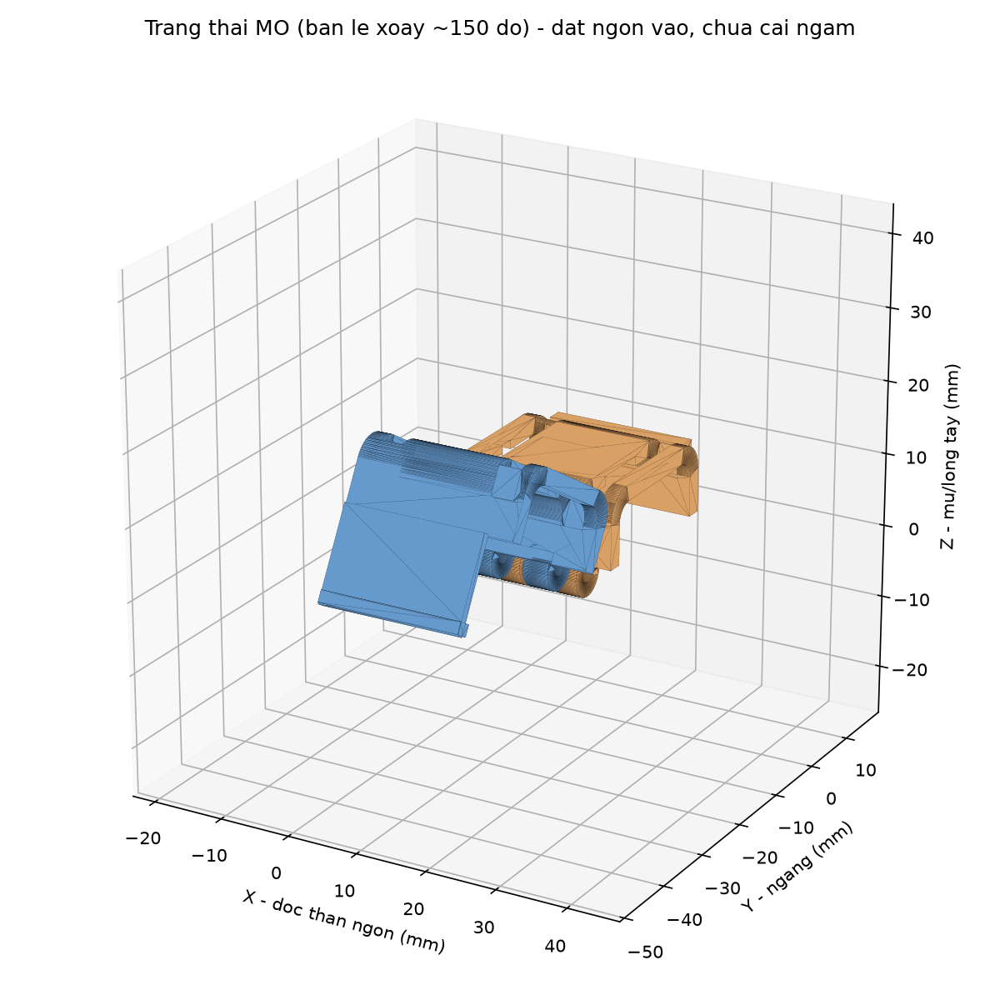
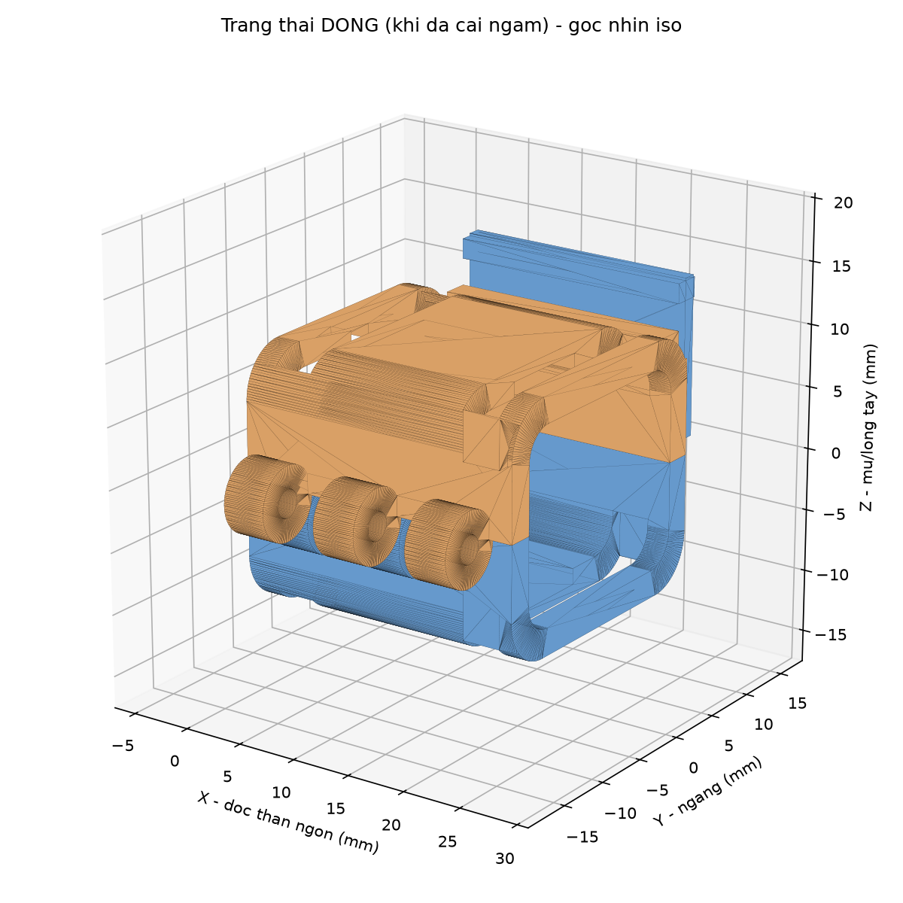
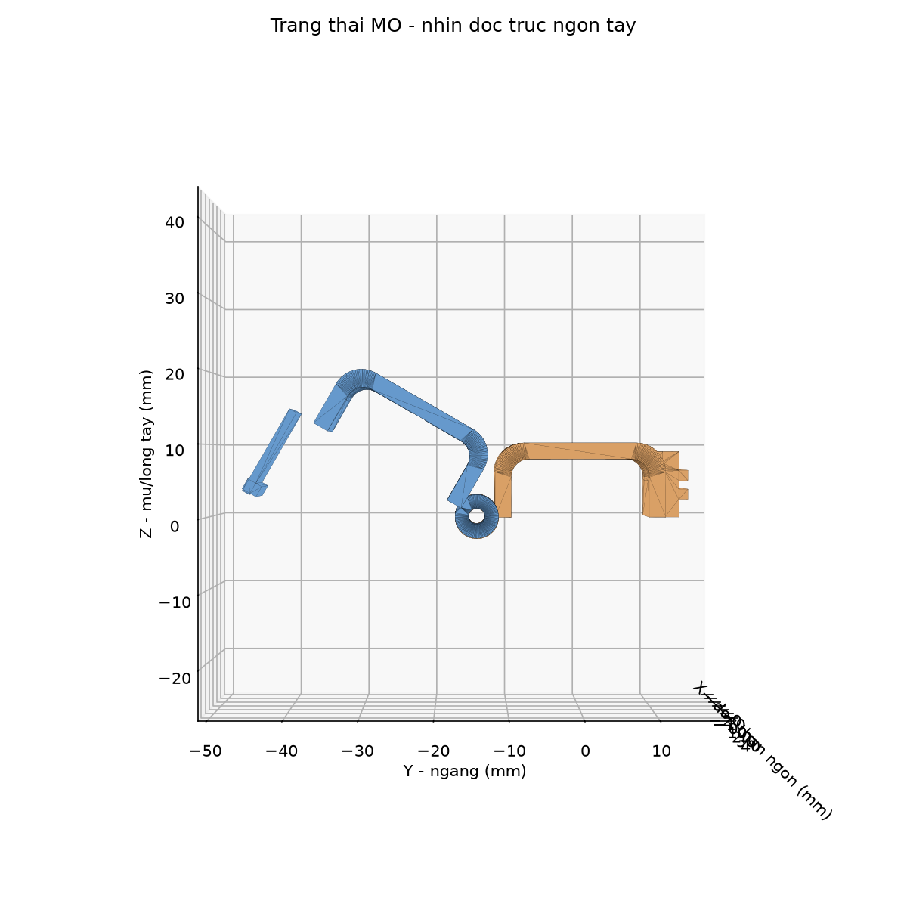
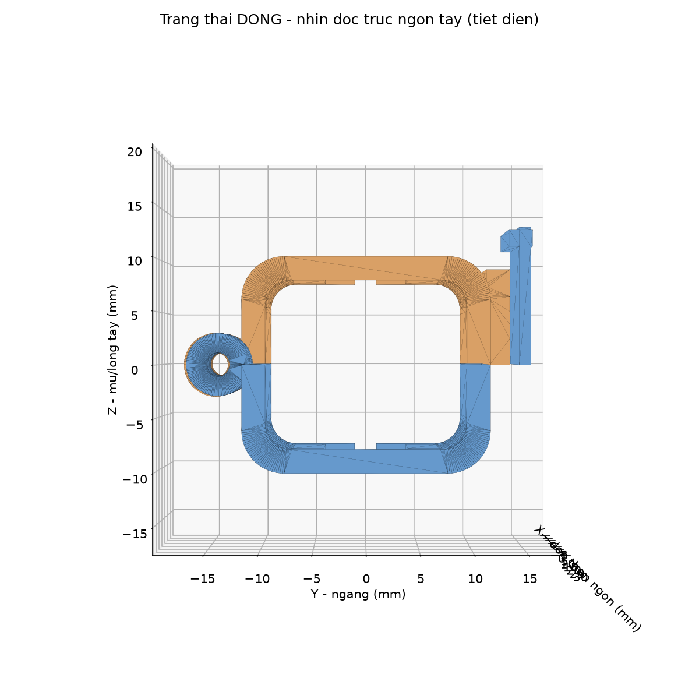
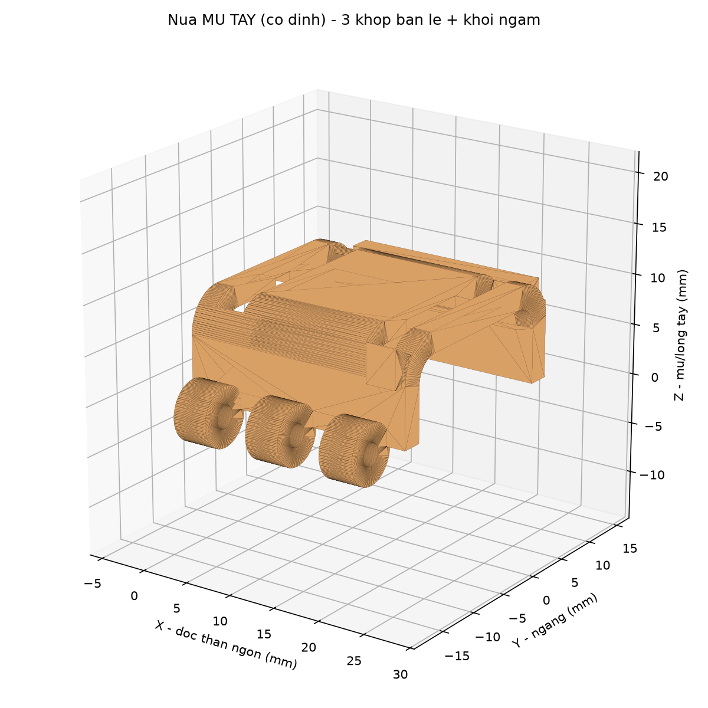
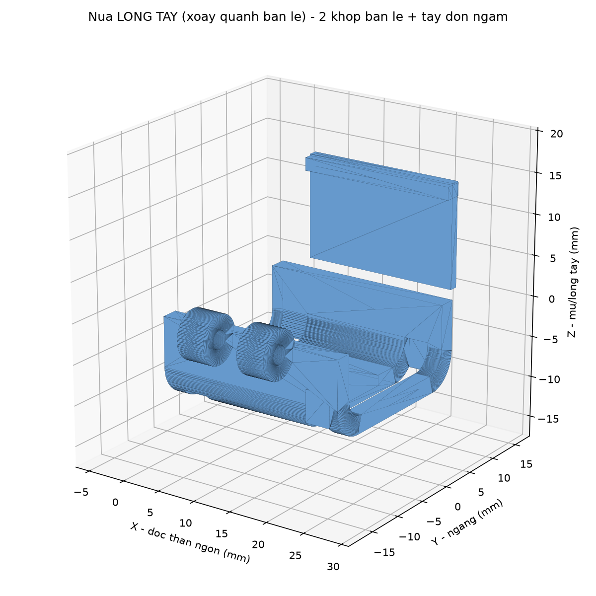
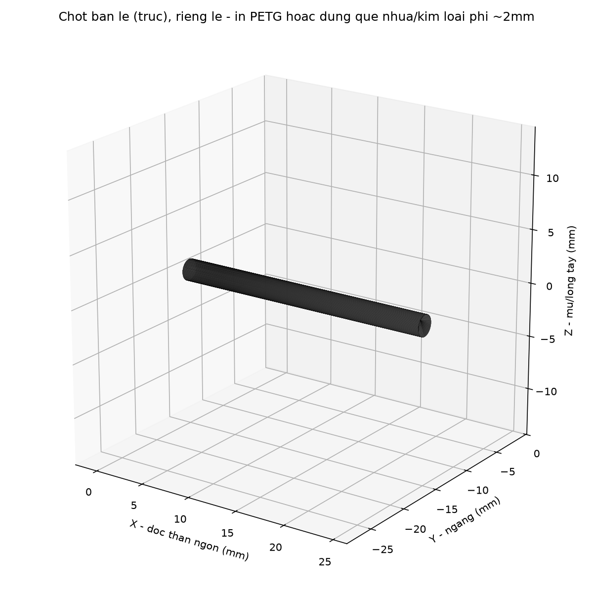

# Khung ốp 1 đốt ngón tay — cơ chế BẢN LỀ + NGÀM CÀI (thay cơ chế "xỏ ngón vào ống kín")

> **Trạng thái:** `PROPOSED` — bản vẽ CAD tham số, **chưa in, chưa đo lực/preload thật, chưa có người dùng thử**.
> **Claim/quyết định liên quan:** `CLM-HW-004` (`research/claims/CLAIM_LEDGER.csv`), `DEC-HW-006` (`research/context/DECISION_LOG.md`).
> **Phạm vi:** làm đúng **1 đốt ngón tay trước** (theo yêu cầu), chưa nhân ra 3–5 ngón.
> Theo `AGENTS.md`: đây là **thiết kế cơ khí trên giấy**, không phải kết quả đo, không phải tuyên bố "đã hết đau/đã thoải mái" — mọi tính từ công thái học (thoải mái, nhanh, không đau) đều là **mục tiêu thiết kế cần kiểm chứng sau khi in**, không phải kết luận.

---

## 1. Vấn đề đang muốn sửa

Thiết kế ốp ngón hiện có trong `docs/04_Hardware_Architecture.md` (§6, §8) là một **ống gần như kín**, có **bu-lông kẹp vi chỉnh preload** siết quanh ngón tay để ép hai vách cảm biến (Velostat) vào hai bên lòng/mu ngón. Nhược điểm với đúng nhóm người dùng của đề tài (sau đột quỵ, bàn tay liệt/co cứng, khó chủ động gập — xem `README.md` §1 mục tiêu đề tài):

- Phải **luồn/ép đốt ngón co cứng qua một vòng gần kín** → đau, khó, nhiều khi cần 2 người.
- Siết bu-lông quanh ngón đang co cứng → khó canh lực, dễ siết lệch, dễ gây khó chịu thêm.

**Yêu cầu của chủ dự án (nguyên văn rút gọn):** "trên đốt ngón có 1–2 bản lề, mở ra để đặt khung vào phía trên tay bệnh nhân, bên dưới chỉ cần cài lại — bệnh nhân không phải cố xỏ ngón tay vào một cách đau đớn."

→ Bài toán cơ khí: biến ống kín thành **vỏ-sò (clam-shell)** có 1 cạnh mở được (bản lề) và 1 cạnh khóa nhanh (ngàm cài), vẫn giữ được 2 vách cứng đối xứng (mu/lòng) để dán sensing element như kiến trúc đo vi sai đã chọn (`docs/04` §3.2, "mỗi khớp có cặp sensing element đối xứng trên hai vách đối diện").

## 2. Tham khảo thị trường (tham khảo nguyên lý — KHÔNG sao chép hình học)

| Sản phẩm/khái niệm | Nguyên lý lấy làm tham khảo | Khác với thiết kế ở đây |
|---|---|---|
| **Oval-8® Finger Splint** (nẹp ngón PIP/DIP bán thương mại) — [AliMed](https://www.alimed.com/products/oval-8-finger-splint) (`SRC-OVAL8-ALIMED`) | "Open design eliminates skin issues and discomfort" — vòng **hở sẵn một khe**, lắp bằng cách lách qua khe đàn hồi, không phải xỏ kín từ đầu ngón | Oval-8 là **một khối nhựa đàn hồi duy nhất** (tự bung ra rồi tự khép lại nhờ độ đàn hồi vật liệu), không có bản lề trục hay ngàm cài rời. Thiết kế ở đây dùng **bản lề trục in 3D + chốt** vì PETG/PLA không đàn hồi tốt như nhựa nhiệt dẻo y tế của Oval-8 → không thể chỉ dựa vào lò xo vật liệu để vừa giữ chặt vừa dễ mở. |
| **Nẹp ngón nhiệt dẻo 2 mảnh** — [Cults3D / RafaelNaranjo](https://cults3d.com/en/3d-model/various/finger-orthosis-thermoformable-3d-printed-rafaelnaranjo) (`SRC-FINGERORTHO-CULTS3D`) | 2 mảnh cứng nối bằng vùng mềm, cố định bằng **dây chun/Velcro xuyên khe** | Thiết kế ở đây giữ ý tưởng "khe xuyên dây đai" làm **lớp khóa an toàn phụ** (mục 6), nhưng khóa chính là ngàm cơ khí chứ không phải dây đai. |
| **HERO Grip Glove** (robot hỗ trợ bàn tay sau đột quỵ, PMC7045638) (`SRC-HEROGLOVE-PMC2020`) | Benchmark công thái học: **don < 5 phút, doff < 1 phút**, thiết kế riêng cho tay liệt/co cứng, không cần tự chủ động gập để đeo | Dùng làm **mốc so sánh mục tiêu** (không phải của thiết bị này) cho tiêu chí "thời gian mang/tháo" đã nêu ở `docs/04` §6. |
| Bản lề khớp ống in 3D kiểu "piano hinge" (kiến thức phổ biến trong cộng đồng in 3D, không gắn với 1 sản phẩm cụ thể) | Khớp ống so le (knuckle) + chốt rời — in được bằng FDM mà không cần vật liệu đàn hồi | Áp dụng trực tiếp cho cạnh bản lề của khung ốp. |

**Tra cứu bằng sáng chế:** chưa thực hiện cho riêng cơ cấu bản lề/ngàm này (khác phạm vi với tra cứu `US20150233779A1`/`CN116954366A` đã ghi ở `README.md` §8, vốn là về *mảng cảm biến*, không phải *cơ cấu kẹp cơ khí*). Cơ cấu bản lề-ngàm nói chung là kỹ thuật phổ biến trong hộp/vỏ nhựa và nẹp y tế; **FTO cho riêng chi tiết này chưa tra**, không tuyên bố mới.

## 3. Nguyên lý cơ cấu đề xuất

```
                    CẠNH BẢN LỀ (trái)             CẠNH NGÀM CÀI (phải)
                   ┌──────────────┐               ┌──────────────┐
  Nửa MU TAY (A)   │  3 khớp ống   │   vách cứng   │  khối ngàm    │
  — cố định,       │  (knuckle)    │  + hốc dán    │  2 nấc răng   │
  đặt lên trước    │  xen kẽ với B │  Velostat     │  (cố định)    │
                   └──────┬───────┘               └──────┬───────┘
                          │ chốt Ø2mm xuyên suốt          │
  Nửa LÒNG TAY (B) ┌──────┴───────┐               ┌──────┴───────┐
  — xoay quanh     │  2 khớp ống   │   vách cứng   │  tay đòn đàn  │
  bản lề để đóng   │  (knuckle)    │  + hốc dán    │  hồi, có móc  │
                   └──────────────┘               └──────────────┘

  Thao tác: (1) đặt đốt ngón vào lòng nửa A (đang để hở, B đang mở ra ~150°)
            (2) gập B xuống quanh trục chốt
            (3) ấn nhẹ tay đòn ở B cho móc "tách" vào 1 trong 2 nấc răng của A
            (4) (tuỳ chọn) luồn dây đai/Velcro qua khe phụ ở 2 đầu để khóa an toàn lớp 2
  Mở ra: lấy ngón tay ra bằng cách bẩy nhẹ tay đòn ra khỏi nấc răng — không cần tháo chốt.
```

Ảnh xem nhanh (dựng từ STL, xem thêm trong `out/renders/`):

| Trạng thái MỞ | Trạng thái ĐÓNG |
|---|---|
|  |  |
|  |  |

Từng mảnh riêng:

| Nửa mu tay (A, cố định, mang khối ngàm) | Nửa lòng tay (B, xoay quanh bản lề, mang tay đòn) |
|---|---|
|  |  |

Chốt bản lề (chi tiết rời, không in liền khối với vỏ — xem lý do ở mục 5):



**Vì sao không dùng "bản lề sống" (living hinge) in liền khối một mảnh?** Living hinge cần vật liệu dẻo dai khi gập mỏng (PP, hoặc TPU) và in rất mỏng (~0,6–1 mm) theo đúng hướng sợi; PETG/PLA — vật liệu đang dùng cho khung ốp (`docs/04` §6) — giòn hơn, living hinge bằng PETG/PLA dễ gãy sau vài chục lần gập/mở. Bản lề trục + chốt rời (kiểu "piano hinge") bền hơn khi in bằng PETG/PLA và cho phép thay chốt nếu mòn.

## 4. Thông số tham số hoá

Toàn bộ nằm trong class `P` ở đầu `finger_shell_hinge.py`. Các số dưới đây là **giá trị khởi tạo cho đốt gần (proximal phalanx) ngón trỏ/giữa người lớn, LẤY TẠM** — bắt buộc đo lại bằng thước cặp trước khi in bản dùng thật (nguyên tắc "ngân sách thiết kế, không phải kết quả đo" — `docs/04` đầu file).

| Tham số | Giá trị khởi tạo | Ý nghĩa |
|---|---|---|
| `L` | 24 mm | Chiều dài khung dọc ngón, đặt giữa thân đốt, tránh 2 khớp MCP/PIP |
| `W_in`, `H_in` | 19 mm, 16 mm | Kích thước trong (ngang × dày) quanh đốt ngón — **phải đo tay** |
| `t_wall` | 2.2 mm | Bề dày vách — PETG, ≥ 5 vòng tường (nozzle 0.4 mm) để cứng vững quanh hốc cảm biến |
| `r_in`, `r_out` | 2.5 / 4.0 mm | Bo góc trong/ngoài — giảm cấn vào da |
| `pocket_w/len/depth` | 8 / 16 / 1.3 mm | Hốc khoét để dán sandwich Velostat + đồng tự dính (theo `docs/04` §6) |
| `r_knuckle`, `r_pin` | 3.0 / 1.15 mm | Khớp ống bản lề (Ø ngoài 6 mm) và lỗ xỏ chốt (Ø 2.3 mm cho chốt Ø2.0–2.2 mm) |
| `n_knuckle_top/bot` | 3 / 2 | Số khớp ống xen kẽ — **phải lệch nhau đúng 1** để xen kẽ đều (có `assert` trong code) |
| `catch_h`, `tooth_h`, `tooth_pitch` | 9 / 0.9 / 2.6 mm | Khối ngàm cố định, 2 nấc răng (preload thấp/cao) |
| `arm_h`, `arm_t`, `arm_hook` | 13 / 1.1 / 1.1 mm | Tay đòn đàn hồi + độ sâu móc |
| `strap_slot_w/h` | 3.2 / 6.0 mm | Khe luồn dây đai phụ (Velcro/thun) — khóa an toàn lớp 2 |

**Cách chỉnh preload (lực ép lên sensing element) ở bản v1 này:** thô, theo 2 nấc răng của ngàm (nấc 1 = ép nhẹ, nấc 2 = ép chặt hơn) — xem mục 8 "Giới hạn" về việc cần tinh chỉnh fine hơn (vít vi chỉnh) ở bản sau.

## 5. Môi trường dựng CAD (đã thử FreeCAD trước, không cài được trong sandbox này)

Theo đúng yêu cầu, đã thử cài FreeCAD trước. Trong môi trường chạy agent này **không có quyền truy cập kho `apt`/Debian** (chỉ cho phép ra ngoài tới GitHub/PyPI/npm), nên **không cài được gói `freecad` qua `apt`** và cũng không có GUI để chạy FreeCAD AppImage. Cũng đã thử tải thẳng **OpenSCAD AppImage** từ GitHub Releases — tải được trang `github.com` nhưng file nhị phân thật được GitHub chuyển hướng (redirect) sang `release-assets.githubusercontent.com`, domain này **không nằm trong danh sách host được phép ra ngoài** của sandbox.

**Giải pháp cuối cùng — 2 bản CAD song song, CẢ HAI đều đã chạy thật và ĐỐI CHIẾU chéo với nhau:**

1. **`finger_shell_hinge.py` (CadQuery → lõi hình học Open CASCADE, cùng lõi FreeCAD dùng bên trong):** cài qua `pip` (gói `cadquery-ocp` lấy OCCT dạng wheel từ PyPI, không cần `apt`). Gói này cần `libGL.so.1` lúc nạp module dù không render OpenGL thật, nên đã tạo một **thư viện giả (`stub`) `libGL.so.1`** bằng `gcc` (toàn hàm rỗng, chỉ để thoả mãn trình liên kết động). Dựng khối/boolean/fillet/xuất STEP/STL chạy trên lõi OCCT thật.
2. **`finger_shell_hinge.scad` (OpenSCAD → lõi hình học CGAL):** viết tay theo cú pháp OpenSCAD để bạn mở trực tiếp bằng app OpenSCAD miễn phí ([openscad.org](https://openscad.org/downloads.html)) trên máy mình, không cần Python. **Đã tìm được cách chạy CHÍNH ENGINE OPENSCAD ngay trong sandbox này** qua gói npm [`openscad-wasm-prebuilt`](https://www.npmjs.com/package/openscad-wasm-prebuilt) (bản WASM của OpenSCAD, chạy qua Node.js — `registry.npmjs.org` nằm trong danh sách host được phép) — xem `render_scad_wasm.mjs`. Đây là OpenSCAD **phiên bản 2025.01.19 thật**, không phải giả lập.

**Kết quả đối chiếu (`cross_check.py`, so thể tích + bounding-box của từng chi tiết xuất ra từ 2 lõi hình học độc lập — OCCT vs CGAL):**

| Chi tiết | Thể tích CadQuery/OCCT | Thể tích OpenSCAD/CGAL | Lệch | Bounding-box |
|---|---:|---:|---:|---|
| `top_shell_dorsal` | 2168.8 mm³ | 2167.5 mm³ | 0.06% | khớp tuyệt đối (24.0 × 32.06 × 13.2 mm) |
| `bottom_shell_palmar` | 1981.9 mm³ | 1980.7 mm³ | 0.06% | khớp tuyệt đối (24.0 × 32.95 × 23.2 mm) |
| `hinge_pin` | 78.5 mm³ | 78.3 mm³ | 0.24% | khớp tuyệt đối (25.0 × 2.0 × 2.0 mm) |

Sai số dưới 0,3% chỉ đến từ rời rạc hoá hình tròn (`$fn`), không phải sai lệch công thức. **Đây là bằng chứng độc lập (2 lõi CAD khác nhau — OCCT vs CGAL — cho cùng kết quả) rằng cả 2 file mô tả đúng cùng một hình học**, chứ **KHÔNG phải** bằng chứng thiết kế đã đúng về công thái học/cơ học — việc đó vẫn cần in thật + đo thật (mục 8).

**Dùng file `.scad` (khuyến nghị nếu bạn chỉ có máy cá nhân, không muốn cài Python):**

```bash
# 1. Cài OpenSCAD (Windows/macOS/Linux): https://openscad.org/downloads.html
# 2. Mở file:
openscad hardware/cad/finger_shell_hinge/finger_shell_hinge.scad
# 3. Trong OpenSCAD: Window > Customizer để chỉnh tham số bằng thanh trượt;
#    đổi biến PART ở cuối file ("top" | "bottom" | "pin" | "assembly_closed" | "assembly_open");
#    F5 = xem nhanh, F6 = render đầy đủ (bắt buộc trước khi xuất);
#    File > Export > Export as STL khi PART="top" hoặc "bottom" để lấy file in.
```

**Dùng file `.py` (CadQuery):**

```bash
python3 -m venv .venv && source .venv/bin/activate
pip install cadquery numpy-stl matplotlib
python3 hardware/cad/finger_shell_hinge/finger_shell_hinge.py   # xuất STEP/STL vào out/
python3 hardware/cad/finger_shell_hinge/render_preview.py       # xuất ảnh xem nhanh vào out/renders/
```

**Tự render `.scad` bằng engine OpenSCAD thật (qua Node.js, không cần cài OpenSCAD desktop) + tự đối chiếu:**

```bash
cd hardware/cad/finger_shell_hinge
npm install                 # cài openscad-wasm-prebuilt (~11MB, 1 gói)
node render_scad_wasm.mjs   # render ca 5 PART bang chinh OpenSCAD, xuat STL vao out/scad/
python3 cross_check.py      # so the tich + bounding-box voi out/*.stl (ban CadQuery)
```

(Nếu máy bạn thiếu `libGL.so.1` khi chạy bản CadQuery — ví dụ container tối giản — chỉ cần cài `libgl1` qua `apt` bình thường; sandbox này mới cần thủ thuật stub vì không có `apt`. Cách FreeCAD GUI thật nếu máy bạn có đủ mạng: `sudo apt-get install freecad && freecad hardware/cad/finger_shell_hinge/out/top_shell_dorsal.step`.)


## 6. Hướng dẫn in 3D (khuyến nghị — chưa kiểm chứng bằng mẫu in thật)

- **Vật liệu:** PETG (đồng bộ với `docs/04` §6), ≥ 5 vòng tường, 100% hoặc ≥ 60% infill ở vùng ngàm/bản lề (chịu lực lặp lại).
- **Hướng in bản lề:** đặt sao cho **trục chốt (trục X của mảnh) thẳng đứng theo trục Z máy in** — lỗ chốt sẽ in theo từng lớp tròn hoàn chỉnh, không cần support, không bị méo do in ngang qua lỗ.
- **Hướng in ngàm/tay đòn:** tay đòn đàn hồi (`arm`) nên in với lớp vân (layer line) **vuông góc hướng uốn** để bền mỏi hơn — nghĩa là in đứng theo chiều dày `arm_t`, không in nằm phẳng.
- **Khớp ống xen kẽ (knuckle):** chừa khe in `knuckle_gap = 0.5 mm` đã tính sẵn trong tham số; nếu máy in dung sai lớn, tăng `knuckle_gap` lên 0.6–0.8 mm để tránh 2 mảnh dính nhau.
- **Chốt bản lề:** file `hinge_pin.stl`/`.step` chỉ để **tham khảo kích thước** (đường kính nhỏ hơn lỗ 0.15 mm/bán kính); thực tế nên dùng que nhựa/kim loại cứng có sẵn (que hàn nhựa, đinh ghim, hoặc đoạn dây đồng/thép Ø2 mm) thay vì in — in một que nhựa mảnh dài 20 mm bằng FDM dễ cong/gãy hơn là dùng vật liệu sẵn có.
- **Hốc cảm biến:** in xong cần làm phẳng nhẹ bề mặt hốc (giấy nhám mịn) trước khi dán sandwich Velostat + đồng, để tiếp xúc đều — đúng tinh thần `docs/04` §4.1 "điện trở tiếp xúc copper–Velostat... cần preload + kẹp cơ khí ổn định".

## 7. BOM cho 1 cụm (1 đốt ngón)

| # | Chi tiết | Nguồn |
|---|---|---|
| 1 | Nửa mu tay (A) — `top_shell_dorsal.stl` | In PETG |
| 1 | Nửa lòng tay (B) — `bottom_shell_palmar.stl` | In PETG |
| 1 | Chốt bản lề Ø~2 mm, dài ~22 mm | Que/dây cứng có sẵn (xem mục 6) — **không bắt buộc in** |
| 2 | Miếng sensing element Velostat + đồng tự dính | Theo `docs/04` §3/§6 (đã có trong BOM hệ thống) |
| 1–2 | Dây đai Velcro/thun phụ (qua `strap_slot`) | Tuỳ chọn, khóa an toàn lớp 2 |

Không cần bu-lông/đai ốc cho bản v1 (khác thiết kế bu-lông kẹp cũ ở `docs/04` §8) — đây chính là điểm đổi để bớt thao tác siết/nới quanh ngón tay.

## 8. Giới hạn tự khai — việc phải làm trước khi dùng thật

Theo đúng tinh thần `AGENTS.md` (không thăng cấp bằng chứng):

1. **Chưa in** — mọi nhận định "dễ đóng/mở, không đau, vừa khít" đều là **mục tiêu thiết kế**, chưa phải kết quả.
2. **Kích thước đốt ngón (`W_in`, `H_in`, `L`) là số giả định** — phải đo thước cặp trên người dùng thật (và nên làm 2–3 size như Oval-8 làm nhiều size).
3. **Preload mới có 2 nấc rời rạc (thô)** — chưa có vít vi chỉnh liên tục như bu-lông cũ; nếu GATE 0 (`research/protocols/08a`) cho thấy cần cửa sổ preload hẹp hơn 2 nấc có thể phân biệt, bản v2 cần thêm vít vi chỉnh (M2) tại khối ngàm.
4. **Chưa đo lực/độ bền mỏi của ngàm và bản lề** — số lần đóng/mở trước khi răng ngàm hoặc khớp ống mòn/gãy là chưa biết, phải đo (khuyến nghị ≥ 50 chu kỳ đóng/mở trên bench trước khi dùng cho GATE A/B).
5. **Chưa kiểm tra hốc cảm biến có giữ sandwich Velostat phẳng, đều áp suất khi đóng ngàm hay không** — cần kiểm bằng giấy cảm áp (pressure-sensitive film) hoặc quan sát trực tiếp trước khi tin số đo từ sensing element.
6. **Fit-to-skin / áp lực điểm (pressure point)** chưa đánh giá — bắt buộc kiểm tra không hằn da sau 15 phút đeo liên tục (tiêu chí đã có sẵn ở `docs/04` §6) trước khi coi là đạt.
7. Đây **không phải** thiết bị tập luyện/hỗ trợ lực — chỉ là khung cơ khí giữ cảm biến, đúng khung an toàn đã khóa ở `AGENTS.md` §4.

**Thứ tự việc làm tiếp theo (đề xuất, chờ owner duyệt `DEC-HW-006`):**
`đo thước cặp → cập nhật tham số → in 1 cặp thử → kiểm lắp/tháo định tính (có đau không, mất bao lâu) → đo lực đóng ngàm bằng lực kế cầm tay → (nếu đạt) dán sensing element → đưa vào `research/protocols/08a` GATE 0`.

## 9. Cấu trúc file

```
hardware/cad/finger_shell_hinge/
├── README.md                 ← file này
├── finger_shell_hinge.py     ← script CadQuery tham số — ĐÃ CHẠY THẬT trong sandbox, nguồn CAD chuẩn
├── finger_shell_hinge.scad   ← mã OpenSCAD tương đương — mở trực tiếp bằng OpenSCAD trên máy bạn
│                                (viết tay theo đúng công thức của bản .py; ĐÃ chạy qua chính OpenSCAD
│                                 2025.01.19 thật trong sandbox này qua openscad-wasm-prebuilt, và đối
│                                 chiếu khớp hình học với bản .py — xem mục 5, cross_check.py)
├── render_preview.py         ← dựng ảnh PNG xem nhanh từ STL CadQuery (matplotlib, không cần GPU)
├── render_scad_wasm.mjs      ← chạy chính engine OpenSCAD (qua Node.js) để render .scad ra STL, kiểm chứng
├── cross_check.py            ← so thể tích + bounding-box giữa out/*.stl (CadQuery) và out/scad/*.stl (OpenSCAD)
├── package.json / package-lock.json  ← khai báo gói npm openscad-wasm-prebuilt dùng cho render_scad_wasm.mjs
└── out/
    ├── top_shell_dorsal.step / .stl       ← nửa mu tay (mang khối ngàm + 3 khớp bản lề)
    ├── bottom_shell_palmar.step / .stl    ← nửa lòng tay (mang tay đòn ngàm + 2 khớp bản lề)
    ├── hinge_pin.step / .stl              ← chốt bản lề (tham khảo kích thước, xem mục 6)
    ├── assembly_closed.step / assembly_open.step   ← lắp ráp 2 trạng thái (có màu, mở bằng FreeCAD/Fusion/...)
    ├── assembly_closed__{top,bottom}.stl / assembly_open__{top,bottom}.stl  ← mesh từng trạng thái
    ├── renders/                           ← ảnh PNG xem nhanh từ bản CadQuery (dùng trong README này)
    └── scad/                              ← STL xuất từ chính OpenSCAD (render_scad_wasm.mjs) — dùng để đối chiếu
```
